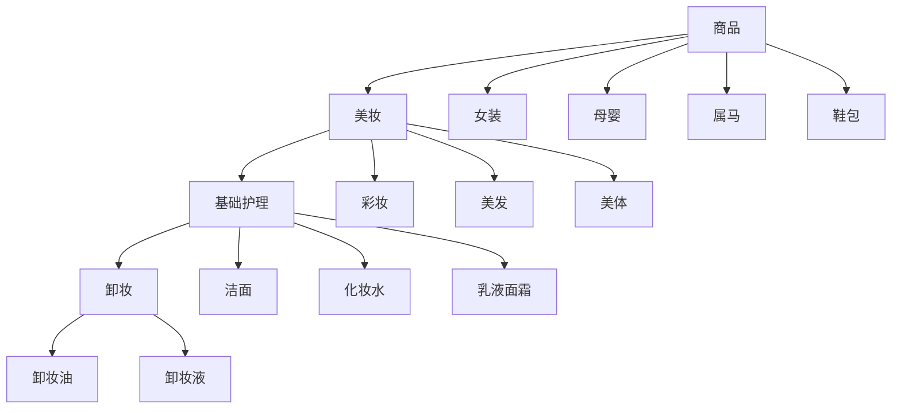
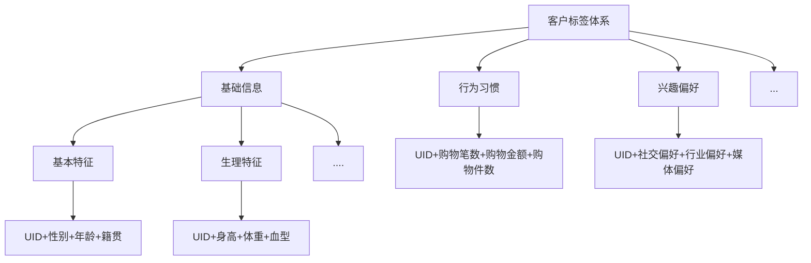

---
title:      数据中台 | 数据体系建设
date:       2024-09-21
author:     Aiden
image: 
    path : source/internal/post-bg-mma-0.png
categories : ['分布式']
tags : ['数据中台']
pin: true
math: true
mermaid: true
--- 

数据中台是企业数据汇聚地，企业的一切数据都汇聚到数据中台，企业业务所需的数据总能在数据中台找到，但数据中台中的数据并不是简单的堆积，各种系统产生的原始数据堆积在一起导致使用成本非常高，这类数据只能在某些数据技术基础非常好的部门使用，而且会经常出现命名不一、口径不一的问题，从而导致整个企业数据无法真正用起来。

**数据中台数据体系是在全域原始数据的基础上，进行标准定义及分层建模，数据体系建设最终呈现的结果是一套完整、规范、准确的数据体系，可以方便支撑数据应用。**

中台数据体系应具备以下特征：

- **覆盖全域数据：** 数据集中建设，覆盖所有业务过程数据，业务在中台数据体系中总能找到需要的数据
- **结构层次清晰：** 纵向的数据分层，横向主题域、业务过程划分，让整个层次结构清晰易理解
- **数据准确一致：** 定义一致性指标，统一命名、统一业务含义、统一计算口径，并有专业团队负责建模，保证数据的准确一致
- **性能提升：** 统一的规划设计，选用合理的数据模型，清晰地定义并统一规范，并且考虑使用场景，使整体性能更好
- **降低成本：** 数据体系的建设使得数据能被业务共享，这避免了大量烟囱式的重复建设，节约了计算、存储和人力成本
- **方便易用：** 易用的总体原则是越往后越能方便地直接使用数据，把一些复杂的处理尽可能前置、必要时做一些冗余处理

上图涉及了4个数据分层：

- **贴源数据层ODS：** 对各业务系统数据进行采集、汇聚，尽可能保留原始业务流程数据，与业务系统基本保持一致，仅做简单整合、非结构化数据结构化处理或者增加标识数据日期等描述信息，不做深度清洗加工。
- **统一数仓层DW：** 数仓层又细分为明细数据层DWD和汇总数据层DWS，与传统数仓功能基本一致，对全历史业务过程数据进行建模存储，对来源于业务系统的数据进行重新组织。
- **标签数据层TDM：** 面相对象建模，对跨业务板块、跨数据域的特定对象数据进行整合，通过ID-Mapping把各个业务板块、各个业务过程中的同一对象的数据打通，形成对象的全域标签体系，方便深度分析、挖掘、应用。
- **应用数据层ADS：** 按照业务的需要从统一数仓层、标签数据层抽取数据，并面向业务的特殊需要加工业务特定数据，以满足业务及性能需求，向特定应用组装应用数据。

> 建设过程中数据的读取也有严格的规范要求：贴源数据层直接从业务系统或日志系统中获取数据，贴源数据层的数据只被统一数仓层使用，统一数仓层的数据只被标签层和应用层使用。贴源数据层、统一数仓层只保存历史数据以及被标签层、应用层引用，不直接石成业务，所有业务使用的数据均来源于标签层和应用层。

### 贴源层数据建设

贴源数据层会对企业各业务系统数据进行汇聚整合，保留企业全量业务原始数据，并作为统一数仓层建设的数据源。

#### 1. 一些相关的概念

贴源数据层是数据体系架构中最接近数据源的一层，是全企业业务数据的集中存储处，除了对非结构化数据进行结构化处理以及对相同数据进行整合外，并不对业务数据做过多的清晰加工，尽可能保留数据的原始状态。

数据中台的贴源数据层数据获取方式与传统数仓的ETL过程类似，但有不同。 **传统数仓的ETL过程是在抽取和装载的过程中进行清洗转换操作，装载到数仓的是被清洗转换后的数据。数据中台的贴源数据的获取建议采用ELT的方式，即将所有原始数据都抽取到数据中台的贴源数据层，在数据中台内部再利用大数据底层平台的计算能力进行转换操作。**

按照数据结构类型的不同，贴源数据可以分为三类：

- **结构化数据：** 主要是关系型数据库中的数据，直接从业务系统DB抽取到贴源数据层。
- **半结构化数据：** 一般是纯文本数据，以各种日志数据为主，半结构化数据保留贴源数据的同时也做结构化处理，为后续使用做准备。
- **非结构化数据：** 主要是图片、音视频，一般保留在文件系统中，由于这类数据量一般比较大，而且没有太多挖掘分析价值，所以贴源数据层不保留原始文件，只保留对原始数据文件的描述，比如地址、名称、类型等。

#### 2. 贴源数据表设计

贴源数据层中的数据表与对应的业务系统数据表原则上保持一致，数据结构上几乎不做修改，所以参考业务系统数据表结构来设计贴源数据层表结构即可，结构设计上没有太多的规范要求。

**贴源数据层数据表设计规范**：

- **贴源数据层表的命名采用前缀+业务系统表名的方式。** 比如，ODS_系统简称_业务系统表名，这样既可以最大限度保持与业务系统命名一致，又可以有清晰的层次，还可以区分来源。
- **贴源数据层表的字段名与业务系统字段名保持一致，在ODS层不做字段命名归一。字段类型也尽可能保持一致，如果数据中台没有与业务系统对应的数据类型则用一个可以兼容的数据类型。**
- **对于一些数据量较大的业务数据表，如果采用增量同步的方式，则要同时建立增量表和全量表，增量表利用后缀标识。** 比如ODS_系统简称_业务系统表名_delta，汇聚到增量表的数据通过数据加工任务合并生成全量表数据。
- **对于日志、文件等半结构化数据，不仅要存储原始数据，为了方便后续的使用还要对数据做结构化处理，并存储结构化之后的数据。原始数据可以按行存储在文本类型的大字段中，然后再通过解析任务把数据解析到结构化数据表中。**

#### 3. 贴源数据表实现

贴源数据层一般采用数据同步工具来实现数据的同步落地，具体的实现步骤如下：

1. 确定业务系统源表与贴源数据层目标表
2. 配置数据字段映射关系，目标表可能会增加采集日期、分区、原系统标识等必要信息，业务相关内容不做转换
3. 如果是增量同步或者有条件地同步部分数据，则配置数据同步条件
4. 清理目标表对应的数据
5. 启动同步任务，往贴源数据层目标表导入数据
6. 验证任务是否可以运行正确，并且采集到准确数据
7. 发布采集任务，加入生产调度，并配置相关限速、容错、质量监控、告警机制。

### 数仓层建设

统一数仓层站在业务的视角，不考虑业务系统流程，从业务完整性的角度重新组织数据。统一数仓层的目标是建设一套覆盖全域、全历史的企业数据体系，利用这套数据体系可以还原企业任意时刻的业务运转状态。

维度建模是实现统一数仓层建设目标的一种推荐建模方式，它用事实表、维度表来组织数据，维度建模具备以下特点：

- **模型简单易理解：** 仅有维度、事实两种类型数据，站在业务的角度组织数据。
- **性能好：** 维度建模使用的是可预测的标准框架，允许数据库系统和最终用户通过查询工具在数据方面生成强大的假设条件，这些数据主要在表现和性能方面起作用。
- **可扩展性好：** 具有非常好的可扩展性，以便容纳不可预知的新数据源和新的设计决策。
- **数据冗余：** 由于在构建事实表星型模式之前需要进行大量的数据预处理，因此会导致大量的数据处理工作。而且，当业务发生变化需要重新进行维度的定义时，往往需要重新进行维度数据的预处理。

#### 1. 一些相关概念

统一数仓层建设过程以维度建模为理论基础，构建总线矩阵，划分业务板块、定义数据域、业务过程、维度、原子指标、修饰类型、修饰词、时间周期、派生指标，进而确定维度表、事实表的模型设计。统一数仓层建设过程如下如所示：

维度建模设计的核心概念：

- **业务板块：** 根据业务的属性划分出的相对独立的业务板块。业务板块是一种大的划分，各业务板块中的业务重叠度极低。
- **模型设计：** 以建模理论为基础，基于维度建模总线架构，构建一致性的维度和事实，同时设计出一套表命名规范。
- **数据域：** 数据域是统一数仓层的顶层划分，是一个较高层次的数据归类标准，是对企业业务过程进行抽象、提炼、组合的集合，面相业务分析，一个数据域对应一个宏观分析领域。
- **业务过程：** 业务过程是一种企业的业务活动事件，且是企业经营过程中不可拆分的行为事件，比如下订单、银行转账都是业务过程。 
- **修饰词：** 修饰词指出统计维度意外的对指标进行限定抽象的业务场景词语，修饰词隶属于一个修饰类型。
- **原子指标：** 原子指标是针对某一业务事件行为的度量，是一种不可拆分的指标，具有明确的业务含义，比如支付金额。
- **派生指标：** 派生指标可以理解为对原子指标业务统计范围的圈定，派生指标=1个原子指标+多个修饰词+时间修饰词。
- **计算方法：** 指标的数学计算方式，比如汇总、平均、最大、最小等
- **维度表：** 维度是观察事物的角度，提供某一业务过程事件所涉及的用于过滤以及分类事实的描述性属性。维度表是统一设计的，在整个数据仓库中共享，所有数据域、业务过程都需要用到维度，都可以在公共维度表中获取相关维度属性。
- **事实表：** 事实是观察事物得到的事实数据，事实涉及来自业务过程事件的度量，基本都是以数量值表示，比如一次购买行为就可以理解为是一个事实。
- **粒度：** 粒度是指统一数据仓数据的细化或综合程度，对各事实表行实际代表的内容给出明确的说明，用于确定某一事实表中的行表示什么。
- **一致性指标定义：** 指标归属到具体数据域，定义指标的含义、命名、类型、计算方法，确保指标的全局一致性。

#### 2.数据域划分

数据域是指面向业务或数据进行本质分析，归纳总结出来的数据集合。为保障整个体系的生命力，数据域需要抽象提炼，并且长期维护和更新，但不轻易变动。在划分数据域时，既能涵盖当前所有的业务需求，又能在新业务进入时无影响地将其插进已有的数据域中或者扩展新的数据域，具体数据域划分过程如下：

**第一阶段：数据调研**

- **业务调研：** 确定项目要涵盖的业务领域和业务线，以及各个业务线可以细分成哪几个业务模块，各业务模块具体的业务流程是怎么样的。
- **数据调研：** 调研全部数据目录信息，梳理数据流与业务过程关系关系

**第二阶段：业务分类**

- **业务过程提取：** 根据调研结果抽取出全部业务过程
- **业务过程拆分：** 将组合型的业务过程拆分成一个个不可分割的行为事件，如下单、支付等
- **业务过程分类：** 按照业务分类规则，将相似特征的业务过程归为一类，且每一个业务过程只能唯一归属于一类

**第三阶段：数据域定义**

- **业务分类确认：** 对业务分类结果再次确认，避免分类范围中出现业务特征明显与其他业务过程无关的情况
- **数据域定义：** 根据业务分类的规律总结出划分业务范围的标准定义
- **数据域命名：** 为每个数据域起一个专属名称，并附上英文全称和简称。

**第四阶段：总线矩阵构建**

- **关系梳理：** 明确每个数据域下有哪些业务过程，并梳理出业务过程与哪些维度相关
- **矩阵构建：** 定义一张二维矩阵，将数据域下的业务过程与维度信息如实记录下来

数据域和业务过程示例：

#### 3.指标设计

指标就是在企业业务运转过程中产生的度量事实，一致性指标设计是为了企业内外部使指标的命名、计算方法、业务理解达到一致，避免不同部门同一个指标的数据对不上或者对同一个指标的数据理解不一致。

一致性指标的定义为，描述原子指标、修饰词、时间周期和派生指标的含义、类型、命名、算法，被用于模型设计，是建模的基础。 派生指标的生成过程如下图：

#### 4.维度表设计

维度是维度建模的基础和灵魂，维度表设计得好坏直接决定了维度建模的好坏。维度表包含了事实表所记录的业务过程度量的上下文和环境。

- 每个维度表都包含单一的主键列
- 维度设计的核心是确定维度属性，维度属性是查询约束条件、分组与报表标签生成的基本来源
- 维度表通常有多列或者多个属性
- 维度表通常比较宽，是扁平型非规范表，包含大量细粒度的文本属性
- 维度表应该尽可能包括一些有意义的文字性描述，以方便下游用户使用
- 维度属性尽可能丰富
- 维度属性设计中会有一些反规范化设计，把相关维度的属性合并到主维度属性中，达到易用、少关联的效果

维度表设计主要包括选择维度、确定主维表、梳理关联维表、定义维度属性等过程。

- **选择维度：** 维度作为维度建模的核心，在企业级数据仓库中必须保证维度的唯一性。 
- **确定主维表：** 主维表一般直接从业务系统同步而来，是分析事实时所需环境描述的最基础、最频繁的维度属性集合，比如用户维表从业务系统的用户基本信息表中产出。
- **梳理关联维表：** 数据仓库是业务数据源系统的数据整合，不同业务系统或者统一业务系统中的表间存在关联性。根据对业务的梳理，确定哪些表和主维表存在关联关系，并选择其中的某些表用于生成维度属性。
- **定义维度属性：** 从主维表或关联维表中选择维度属性或生成新的维度属性，过程中尽量生成更丰富、更通用的维度属性，并维护和描述维度属性的层次和关联关系。

#### 5.事实表设计

事实表是统一数仓层建设的主要产出物，统一数仓层绝大部分表都是事实表。

事实表一般由两部分组成：
- 一部分是由主键和外键组成的键值部分，键值部分确定了事实表的粒度，事实表通过粒度和事实度量来描述业务过程；事实表的外键总是对应某个维度表的主键。
- 另一部分是用来描述业务过程的事实度量。

在维度建模理论中定义了三种类型的事实表：

- **事务事实表：** 事务事实表描述业务过程事务层面的事实，每条记录代表一个事务事件，保留事务事件活动的原始内容。
- **周期快照事实表：** 周期快照事实表以具有规律性、可预见的时间间隔产生快照来记录事实，每行代表某个时间周期的一条记录，记录的事实是时间周期内的聚集事实值或者状态度量。
- **累积快照事实表：** 累积快照事实表覆盖一个事务从开始到结束之间所有的关键事件，覆盖事务的整个生命周期，通常具有多个日期字段来记录关键事件时间点。

事实表的设计可以遵循以下步骤：

**第一步：确定业务过程**

企业业务是由一个个业务过程组成的，事实表就是为了记录这些业务过程产生的事实，以便还原任意时刻的业务运转状态。所以设计事实表，第一步就是确定事实所要表达的是哪一个或者几个业务过程。

**第二步：定义粒度**

不管事实表对应一个还是多个业务过程，粒度必须是确定的，每个事实表都有且只能有唯一的粒度，粒度是事实表的每一行所表示的业务含义，是事实的细节级别。

**第三步：确定维度**

定义粒度之后，事实表每一行的业务含义就确定了。那么业务人员会站在哪些角度来描述事实度量，这就要确定维度了，常见的维度有时间、区域、客户、产品等。 维度依赖于粒度，是粒度的环境描述。

**第四步：确定事实**

事实就是事实表度量的内容，也就是业务过程产生的事实度量的计算结果，比如注册量、登录次数、交易金额等。 事实表的所有事实度量都与事实表所表达的业务过程相关，所有事实必须满足第二步所定义的粒度。

**第五步：冗余维度属性**

事实表的设计要综合考虑数据来源和使用需求，在满足业务事实记录的同时也要满足使用的便利性和性能要求。 利用标准维度模型会经常出现维表与事实表关联的情况，这种对亿级表的关联计算，在性能上是灾难性的。为了满足业务需求，降低资源消耗，建议适当冗余维度属性数据到事实表，直接利用事实表就可以完成绝大部分业务的使用需求，这样下游使用时可减少大表关联，提升效率。

#### 6.模型落地实现

经过以上数据域的划分、指标的定义、维表设计、事实表设计，就完成了整个统一数仓层的设计工作。接下来要在数据开发平台结合数据平台工具，进行统一数仓层的物理层面的建设。

落地实施的具体步骤如下：

1. 按照命名规范创建表，包括维度表和事实表
2. 开发生成维度表和事实表数据的逻辑代码
3. 进行代码逻辑测试，验证数据加工逻辑的正确性
4. 代码发布，加入生产调度，并配置相应的质量监控和报警机制
5. 持续任务运维监控

### 标签层建设 

统一数仓层是按照数仓的维度规范建模，对业务数据进行了重新组织标准化，但是同一个对象的各种信息分散在不同的数据域并且有不同的数据粒度，这就导致很难了解一个客户的全面信息，要通过各种关联计算才能满足业务的需要，数据使用成本较高，而获取、分析客户的全面数据，是多个业务的共同需求，这可以通过建设标签数据层来满足。

#### 1.相关概念

标签数据层是面向对象建模，把一个对象各种标识打通归一，把跨业务板块、数据域的对象数据在同一个粒度基础上组织起来打到对象上。

标签归属到一个对象上，标签按照产生和计算方式的不同可分为属性标签、统计标签、算法标签。

- 对象本身的性质就是**属性标签**
- 对象在业务过程中产生原子指标，原子指标与修饰词、计算方法可以组装出**统计标签**
- 对象在多个业务过程中的规律特征通过一定的计算方法可以计算出**算法标签**
- 对象在特定的业务过程中会与其他对象关联，关联对象的属性也可以作为标签打在主对象上

对象的属性标签、统计标签、算法标签与对象标签类目、对象标识组装起来就生成对象标签表，对于对象标签表来说一切都是标签，并没有严格的维度与事实的区分。

- **对象：** 是客观世界中研究目标的抽象，可以是现实存在的，也可以是虚拟的，是具备独立特征的个体。
- **对象标识：** 对象标识符用以标识一个对象，一般是各种ID。
- **标签：** 利用原始数据，通过一定的加工逻辑产出，能够为业务所直接使用的可阅读、易理解、有业务价值的数据。
- **标签类目：** 是标签的分类组织方式，是标签信息的一种结构化描述，目的是管理、查找标签，一般采用多级类目。
- **属性标签：** 属性是对实体基本性质的刻画，属性的变化非常缓慢甚至固定，属性是一类实体区别于另一类实体的差异所在。
- **统计标签：** 统计标签是特定场景下，维度和度量的组合。构建出实体所在场景的维度、度量矩阵，就可以根据经验和实际业务需要组装统计标签。
- **算法标签：** 算法标签不可以直接获取的，需要通过复杂逻辑分析推理得出，是通过分析对象在多个场景下发生多个事件的规律性得出来的相关结论。
- **标签融合表：** 以对象为核心把属性标签、统计标签、算法标签组装起来得到的表，是标签数据层落地的产出物，标签融合表设计要考虑标签的类目结构进行合理组织。

#### 2. 确定对象

进行标签建设，首先要清楚对哪类对象建设标签，也就是确定对象。经过对多个行业、多个标签体系建设经验的总结，可把对象分为“人”、“物”、“关系”三大类。

- “人”包括自然人、自然人群体、法人、法人群体等，例如消费者、消费者协会、电商企业、电商企业联合会，这类是可以主动发起行为的主体。“人”往往具有主动性和智慧，能主动参与社会活动，主动发挥推动作用，往往是关系的发出者。
- “物”包括物品、物体、物品集合等，例如商品、仓库等，是行为中的被施与对象。“物”往往是被动的，包括原料、设备等，是关系的接受者。
- “关系”指的是人、物、人和物、人和人、物和物在某时某刻发生的某种行为、关联、关系，包括行为关系、归属关系等，例如购物、运货、聊天。“关系”属于一种虚拟对象，是对两两实物实体间的联系的定义。

明确了对象的定义和分类，就可以根据业务的需要确定对哪些对象建立标签体系。企业的对象非常多，不会对所有对象都建立标签体系，一般都是选择典型的对象建立标签体系，比如客户、员工、产品、设备等。

#### 3. 对象ID打通

在确认对象后，由于存在同一个对象在多个不同业务中的标识ID不同的情况，因此需要将同一个具体对象的不同ID标识打通，以便所有业务数据都能在该对象上打通，完成对该对象的全面数据的刻画。

要完成对象的ID打通，一般会给每个对象设置一个超级ID，比如SUPER-ID作为唯一识别该对象的标识码，业务系统中不同的对象标识ID都通过一定的算法规则与这个SUPER-ID打通，进而完成对象所有业务标识ID打通。

一般来说，ID打通是标签体系建设的前提，没有ID打通就无法收集一个对象的全面信息，也就无法对这个对象进行全面标签化刻画。

#### 4. 标签类目设计

构建标签类目体系首先需要确定根目录。根目录就是上问题到的对象，因此有三大类根目录：人、物、关系。 根目录就像树根一样直接确定这是一棵什么树。

对根目录进行展开，可以构建多级类目结构：针对人、物、关系的标签集都可以分别构建出多级的标签类目体系。

标签类目体系是对业务所需标签采用类目体系的方法进行设计、归属、分类。类目体系本身是对某一类目标物进行分类、架构组织，分类通常使用一级类目、二级类目、三级类目等作为分类名，将item分入合适的类目中，每个具体的item都是叶节点。

类目体系的层级构建尽量以用户最容易理解的分类方式展开，因为类目体系存在的核心意义即为帮用户快速查找、管理数据/标签。

数据类目体系建议按照数据采集、存储、管理等系统原有的业务体系进行划分，因为对于数据开发者或者数据库管理员来说，按照数据产生、存储等技术方式组织的数据查找方式是最容易理解的，这样划分可以让他们在合适的类目下快速找到所需数据。

标签类目体系则建议按照数据理解、使用、价值等数据应用的角度进行划分，因为标签类目体系的作用是供业务方、产品经理等数据使用者理解、查找、探索业务上所需指标。

将以上各项内容，即人的标签类目体系，物的标签类目体系，关系的标签类目体系汇总后，可以得到一家企业的标签类目体系结构图。

通常说的标签体系，一般是指一类对象的标签类目 + 标签。对象标签体系设计的核心是标签类目设计，标签类目设计完成后整个标签体系的框架就有了，接下来要做的就是往每个叶类目下填充有业务价值并且可以加工出来的标签，进而让完成整个标签体系的设计。

#### 5. 标签设计

通过标签类目设计，已经有了某类对象的标签体系框架，只是还没有具体的标签内容。标签设计就是设计合适的标签并将其挂载到标签类目。

标签本质上是一种对客观世界中实体对象的度量和描述，是经过缜密的逻辑分析和处理后的产物，用以引导发挥数据应用价值。 数据必须转化成能帮助业务提升的标签才具有价值。

标签即业务需求的数据呈现，商业价值核心承载在标签上，再配以相应的工程化能力，将标签快速、稳定、便捷地输送到业务以供使用，即完成了数据服务过程。

将数据提炼转化为标签的过程就叫标签化，也就是标签设计过程。标签设计要充分考虑两大前提条件：

- 标签必须是业务上需要的，能体现业务价值，帮助业务人员做出业务判断或者能创造性引申新业务场景的数据项，在业务中往往会称其为属性、特征、指标、参数等
- 必须要探查清楚根据业务需求提炼、整理出的标签是否具有数据可行性，是否有原始数据可以用于加工成标签数据。

标签的设计是业务需求与经验结合的结晶，是一个漫长的持续迭代的过程，没有一个具体的步骤可以快速构建。梳理清楚标签设计容易混淆的一些概念、设计所包含的内容及注意事项，有助于设计出更规范化、体系化、可扩展的标签体系。

##### 5.1 标签根目录、标签类目、标签和标签值

1. 标签根目录指的是标签的对象，往往是一种较为模糊、宽泛、简单的名词或动词。 在物理层面可以和某张大宽表中的主键对应，这张大宽表是对该主键对象的详细刻画和数据记录。
2. 对对象的拆分及对象的角度、层面或过程，一般是类目。在物理层面可以和某张具体表对应，多张这样的具体表按照共同的主键关联在一起就可以形成该主键对象的大宽表。
3. 对对象具体属性、特征、信息、内容的字段级刻画，就是标签。 在物理层面可以和某张具体表中的字段对应，比如最近一天用户量、最近三天用户量、最近7天用户量，这些时间维度不同、统计方式和统计对象相同的标签，属于3个标签，因为它的底层由3个字段一一对应。
4. 对对象属性、特征、信息、内容的具体取值，是标签值。在物理层面可以和某张具体表中的字段值字典对应，标签值有些是可枚举的离散值，有些是不可枚举的连续值。

##### 5.2 标签设计内容

标签的标签，即元标签的设计内容主要包括标签类目、标签名、标签加工类型、标签逻辑、值字典、取值类型、示例、更新周期、安全等级、表名、字段名、负责人、完成时间等。其中“标签类目、标签名、标签加工类型、标签逻辑、值字典、取值类型、示例、更新周期、安全等级”偏向业务方向，主要是与业务相关的指标。 “表名、字段名、负责人、完成时间”偏向技术方向，主要是技术开发实施过程相关的指标。

##### 5.3 标签设计注意事项

1. 某具体对象某标签的标签值，只允许有一条记录，即对应在数据表里，是一个字段取值。例如人的某个标签的标签值。
2. 对于人——物——关系各对象的标签间的转化，大家可能会认为身份证号、证件号是用户的标签，但实际上身份证号、证件号是“物”的标签，要变成“用户”的标签，需要转化成“拥有的身份证号”这个标签。

经过以上原则方法，可以设计出符合企业业务需要的标签体系，由于企业的业务在不断变化，数据在不断变化，业务对标签的诉求以及标签的加工方式也在不断变化，所以企业的标签体系建设应该是一个动态调整的过程。

#### 6.标签融合表设计

对象的标签体系是对象有价值数据的全域标签，跨业务板块、跨主题，包括属性标签、统计标签、算法标签，比如性别、消费额、品牌偏好都是标签。对于标签表来说没有维度与事实区分。

一般标签融合表有两种组织的方式：

1. 纵表：类似KV表，每行表示对象的一个标签，通常的表结构如下：

| ID | 标签名 | 标签值 |
|:---|:---|---:|
| | | |

2. 横表：就是普通的二维表，每行表示一个对象，包含对象的多个标签，表结构如下：

| ID | 标签1 | 标签2 | 标签3 | ... |
| :--- | :--- | :--- | :--- | ---: |
| | | | | |

通过以上结构，对纵表和横表做个对比：

- 模型稳定性：纵表模型比较稳定，要增加新的标签时增加记录即可无需修改模型结构；横表模型不稳定，只要增加或者修改标签元数据，都会涉及模型的修改。
- 易用性：横表就是普通的二维表，比较容易理解，易用性较高。纵表类似KV表，只适合做单值的查询，对于复杂计算不方便，易用性较差。
- 性能：纵表每增加一个标签，就要所有对象都增加一条记录。而横表增加标签仅增加标签列，不管有多少标签，行数都是跟对象数相同，性能相对较好。

#### 7.标签融合表实现

经过对象的确定、对象ID的打通、标签类目设计、标签设计、标签融合表设计，就完成了标签数据层一个对象的模型设计工作。标签融合表的实现就是利用数据中台的数据开发能力开发代码，加工设计好的标签融合表数据。标签融合表开发实施与统一数仓层类似，在数据中台的开发平台进行代码和运维实施。

落地实施的具体步骤如下：

1. 按照命名规范标签表
2. 开发生成标签表数据的逻辑代码
3. 进行代码逻辑测试，验证数据加工逻辑的正确性
4. 代码发布，加入生产调度，并配置相应的质量监控和报警机制
5. 持续任务运维监控

### 应用数据层

统一数仓层和标签数据层数据相对稳定，然而最终用户的需求和使用方式是千变万化的，统一数仓层和标签数据层无法灵活适应各类用户的使用需求。为了解决规范稳定和灵活、高性能之间的矛盾，要增加应用数据层。

#### 1. 相关概念

*   应用数据层是按照业务使用的需要，组织已经加工好的数据以及面向业务的特定个性化指标加工，以满足最终业务应用的场景。
*   应用数据层类似于传统的数据集市，但是比数据集市更轻量化、更灵活，用于解决特定的业务问题。应用数据层整体而言是构建在统一数仓层与标签数据层之上的简单的数据组装层，应用数据层的构建和完善是从企业级多个类似业务场景来考虑的，同时又具备数据集市灵活响应业务需求的特点。

#### 2. 应用数据表设计

应用数据层是在统一数仓层、标签数据层都已经建设好的基础上，面向特定业务需求而准备的个性数据组装层，除了特殊的业务个性标签需要单独加工外，其他尽可能复用统一数仓层和指标数据层的建设成果。

应用数据层的建设是强业务驱动的，业务部门需要参与到应用数据层的建设中来。 一般来说，业务部门的业务专家把业务需求告知数据部门的数据工程师，然后在建模过程中深入沟通，这样最终形成的应用数据层的表设计才能既满足业务需求又符合整体的规范。因此应用数据层的特点就是考虑使用场景，其有以下几种结构：

1.  应用场景是多维的即席分析，一般为了减少连接、提升性能，会采用大宽表的形式组织
2.  如果是特定指标的查询，可以采用KV表形式组织，涉及到此类表的时候需要深入了解具体的查询场景，例如是否有模糊查询，以便于选择最适合的数据结构
3.  有些场景下一次要查询多种信息，也可能会用复杂的数据结构组织

#### 3. 应用数据表实现

应用数据层建设步骤如下：

1.  调研业务应用对数据内容、使用方式、性能的要求，需要明确业务应用需要哪些数据，数据是怎么交互的，对于请求的响应速度和吞吐量等有什么要求。
2.  盘点现有统一数仓层、标签数据层数据是否满足业务数据需求，如果满足则直接跳入第三步；如果有个性化指标需求，则进行个性化数据加工
3.  组装应用层数据。组装考虑性能和使用方式，比如应用层是多维的自由聚合分析，那就把统一数仓层、标签数据层以及个性化加工的指标组装成大宽表；如果是特定指标的查询，可以考虑组装成KV结构数据

#### 4. 应用数据场景化支撑

不同使用场景对数据的组织方式和底层的存储计算技术的要求是不同的，应用层的模型设计要考虑业务需要和技术环境。应用数据层加工的结果数据集，要根据不同的使用场景，同步到不同的存储介质中，以达到业务对不同吞吐量和响应时间的需要。

比如交叉分析和特定指标查询，所有数据都是数据工程师、算法工程师在数据平台中加工而成的，一般采用分布式离线加工，加工的结果存放在分布式文件中。但是交叉分析和指标查询都需要毫秒级的响应，大数据存储层计算环境无法满足这样的低延迟要求，这样就需要把加工好的数据同步到可以满足的环境介质中。交叉分析一般同步到具备高吞吐、低延迟的即席分析环境；指标查询一般同步到KV数据存储。这样就达到一套数据多套存储，以满足业务对于性能的要求。
