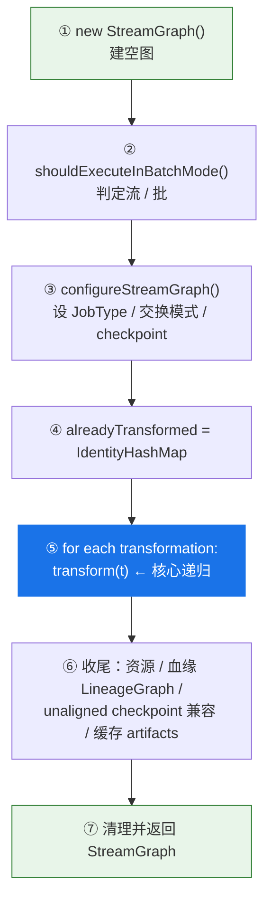
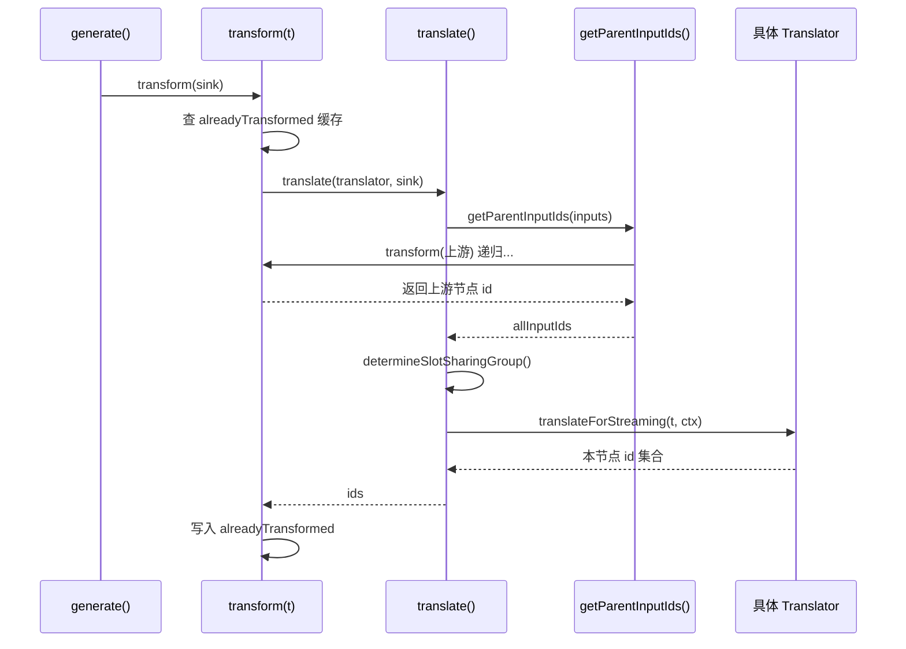
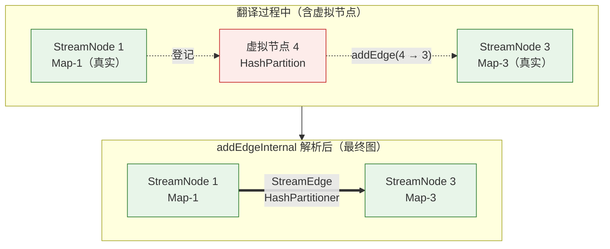
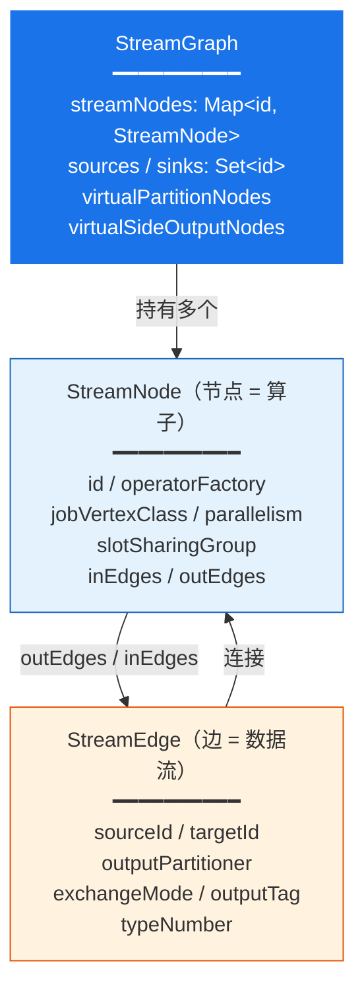
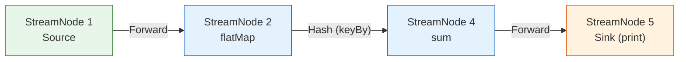

## 二、中观·阶段一：Transformation 树的构建（编程期）

很多人第一次读 Flink 源码会困惑：明明调用了 `map().keyBy().sum()`，怎么没看到建图的代码？答案就是**延迟构建**——每个算子调用只做一件事：*创建一个 Transformation，并把它登记到环境的列表里*。

### 2.1 算子如何变成 Transformation

以最常见的单输入算子为例，`map` / `flatMap` / `filter` / `process` 最终都走到 `DataStream.doTransform()`：

```java
// DataStream.java （约 734 行，已精简）
protected <R> SingleOutputStreamOperator<R> doTransform(
        String operatorName, TypeInformation<R> outTypeInfo,
        StreamOperatorFactory<R> operatorFactory) {

    transformation.getOutputType();   // 提前触发 MissingTypeInfo 检查

    // ① 创建一个 OneInputTransformation，input 指向上游 transformation
    OneInputTransformation<T, R> resultTransform = new OneInputTransformation<>(
            this.transformation, operatorName, operatorFactory,
            outTypeInfo, environment.getParallelism(), false);

    SingleOutputStreamOperator<R> returnStream =
            new SingleOutputStreamOperator(environment, resultTransform);

    // ② 登记到环境的 transformations 列表
    getExecutionEnvironment().addOperator(resultTransform);
    return returnStream;
}
```

而 `addOperator` 的实现简单到只有一行——这正是"懒"的体现：

```java
// StreamExecutionEnvironment.java （约 1657 行）
public void addOperator(Transformation<?> transformation) {
    Preconditions.checkNotNull(transformation, "transformation must not be null.");
    this.transformations.add(transformation);   // 仅仅是 add，不建图
}
```

> 关键点：`transformations` 列表里通常只保存**被 sink 链路拉起的那些 Transformation**。中间算子（如 map）并不会单独成为"根"，它们通过 `input` 引用被下游算子串起来，最终由 sink 这条链递归触达。

### 2.2 常见算子到 Transformation 的映射表

下面这张表覆盖了日常开发中的绝大多数算子，构造点均来自 2.2 源码（行号为近似位置，便于定位）。改源码时，想知道某个算子"长成什么 Transformation"，查这张表即可：

| 算子 / API | 生成的 Transformation | 构造点 | 说明 |
|---|---|---|---|
| `map` / `flatMap` / `filter` / `process` | `OneInputTransformation` | `DataStream.doTransform()` | function 包装成 OperatorFactory |
| `transform(...)` | `OneInputTransformation` | 同上 | 自定义算子入口 |
| `assignTimestampsAndWatermarks` | `TimestampsAndWatermarksTransformation` | `DataStream.java` | 水位线分配 |
| `keyBy` | `PartitionTransformation` + `KeyGroupStreamPartitioner` | `KeyedStream.java` | **虚拟**，按 key 哈希分发 |
| `rebalance` | `PartitionTransformation` + `RebalancePartitioner` | `setConnectionType()` | 轮询均衡 |
| `shuffle` | `PartitionTransformation` + `ShufflePartitioner` | `DataStream.java` | 随机分发 |
| `broadcast` | `PartitionTransformation` + `BroadcastPartitioner` | `DataStream.java` | 广播到所有下游 |
| `rescale` / `global` / `forward` | `PartitionTransformation` + 对应 Partitioner | `setConnectionType()` | 局部/单点/直传 |
| `partitionCustom` | `PartitionTransformation` + `CustomPartitionerWrapper` | `DataStream.java` | 自定义分区 |
| `union` | `UnionTransformation` | `DataStream.java` | **虚拟**，多输入合并 |
| `connect` + Co* | `TwoInputTransformation` | `ConnectedStreams.java` | 双输入算子 |
| `connect`(broadcast) | `BroadcastStateTransformation` / `KeyedBroadcastStateTransformation` | `BroadcastConnectedStream.java` | 广播状态 |
| `reduce`(KeyedStream) | `ReduceTransformation` | `KeyedStream.java` | `sum/min/max` 等聚合 → `OneInputTransformation` |
| `getSideOutput` | `SideOutputTransformation` | `SingleOutputStreamOperator.java` | **虚拟**，侧输出 |
| `addSource` | `LegacySourceTransformation` | `DataStreamSource.java` | 老 SourceFunction |
| `fromSource` | `SourceTransformation` | `DataStreamSource.java` | 新 Source（FLIP-27） |
| `addSink` | `LegacySinkTransformation` | `DataStreamSink.java` | 老 SinkFunction |
| `sinkTo` | `SinkTransformation` | `DataStreamSink.java` | 新 Sink（FLIP-143/191） |
| `cache` | `CacheTransformation` | `CachedDataStream.java` | 结果缓存 |

### 2.3 Transformation 继承体系

所有 Transformation 都继承自 `flink-core` 中的抽象基类 `Transformation<T>`。它通过一个静态自增计数器为每个实例分配唯一 `id`：

```java
// flink-core: api/dag/Transformation.java
private static final AtomicInteger ID_COUNTER = new AtomicInteger(0);
public static int getNewNodeId() {
    return ID_COUNTER.incrementAndGet();   // 每个 Transformation 一个唯一 id
}
protected final int id;
```

基类还承载了一组贯穿全程的字段：`name`、`outputType`、`parallelism`、`maxParallelism`（默认 -1，上限 `1<<15`）、`uid`、`userProvidedNodeHash`、`bufferTimeout`、`slotSharingGroup`、`coLocationGroupKey` 等。这些字段在翻译阶段会被原样"搬运"到 StreamNode 上。



这里有一个值得记住的分界：**左侧 `PhysicalTransformation` 会生成真实 StreamNode；右侧属性型 Transformation 不会**，它们只是携带"数据怎么分发"的信息。这正是第五节"虚拟节点"机制的根源。

---

## 三、中观·阶段二：execute() 如何触发成图

当 sink 都定义完，`env.execute()` 就是那把扳机。它的调用栈非常直接：



有两个细节对改源码的人很重要：

- **列表拷贝**：`getStreamGraphGenerator()` 中用 `new ArrayList<>(transformations)` 拷贝一份，确保成图过程中即使有新 Transformation 加入也不会干扰本次结果；列表为空则抛 `IllegalStateException("No operators defined...")`。
- **清空列表**：`getStreamGraph(true)` 在生成后会 `transformations.clear()`，避免同一个 env 多次 `execute()` 时重复执行旧拓扑。

---

## 四、中观·阶段三：generate() 总览

`StreamGraphGenerator.generate()` 是整个转换的"主控流程"。它先准备一张空图与执行模式，再遍历 transformations 逐个递归翻译，最后做一系列收尾。下面是它的骨架流程：



关于流/批判定（`shouldExecuteInBatchMode()`）：配置为 `BATCH` 直接走批；`AUTOMATIC` 时看是否存在 unbounded source（`existsUnboundedSource()`，即某 source 的 `Boundedness != BOUNDED`）——无界则流、有界则批；若显式 `BATCH` 却存在 unbounded source 会直接报错。这一判定的影响会在第八节展开。

---

## 五、微观：递归翻译机制

这一节是全文的核心。所谓"翻译"，就是把一个 Transformation 变成 StreamGraph 里的节点和边。整套机制由三个角色协作：**调度器**（generate 里的 transform/translate）、**翻译器注册表**（translatorMap）、**具体翻译器**（各 Translator）。

### 5.1 transform() 与 translate()：自底向上的递归

`transform(t)` 先做去重与兜底，再从注册表取出翻译器；`translate()` 则**先递归翻译所有输入**，拿到上游节点 id 后再翻译自己。调用栈如下：



`transform(t)` 的要点（`StreamGraphGenerator` 约 466 行）：

1. 命中 `alreadyTransformed` 直接返回——这是处理 DAG 复用与 feedback 环的关键；
2. 为 maxParallelism 兜底（取全局配置），处理 slotSharingGroup 的细粒度资源；
3. 调用 `transform.getOutputType()` 触发类型检查；
4. 从 `translatorMap` 取出对应翻译器，命中则 `translate()`，否则走 `legacyTransform()`（仅处理 `SourceTransformationWrapper`，其余抛 *Unknown transformation*）。

`translate()` 的要点（约 585 行）：

```java
private Collection<Integer> translate(translator, transform) {
    // ① 递归翻译所有输入，拿到上游节点 id（自底向上的核心）
    List<Collection<Integer>> allInputIds = getParentInputIds(transform.getInputs());
    // ② 递归过程中可能已翻译，二次检查缓存
    if (alreadyTransformed.containsKey(transform)) return alreadyTransformed.get(transform);
    // ③ 确定 slot sharing group：用户指定 > 继承输入同组 > default
    String slotSharingGroup = determineSlotSharingGroup(...);
    // ④ 构造上下文，按流/批分发
    Context context = new ContextImpl(this, streamGraph, slotSharingGroup, configuration, transformations);
    return shouldExecuteInBatchMode
            ? translator.translateForBatch(transform, context)
            : translator.translateForStreaming(transform, context);
}
```

> **slot sharing group 的传播规则**（`determineSlotSharingGroup`）：用户显式指定则用指定值；否则若所有输入都属于同一个组，就继承该组；否则退回 `default`。这条规则决定了哪些算子可以共享一个 slot。

### 5.2 翻译器注册表 + 模板方法

翻译器的分发靠一张静态映射表 `translatorMap`（`StreamGraphGenerator` 约 162 行），把每种 Transformation 类映射到它的翻译器：

```java
tmp.put(OneInputTransformation.class,   new OneInputTransformationTranslator<>());
tmp.put(TwoInputTransformation.class,   new TwoInputTransformationTranslator<>());
tmp.put(SourceTransformation.class,     new SourceTransformationTranslator<>());
tmp.put(SinkTransformation.class,       new SinkTransformationTranslator<>());
tmp.put(PartitionTransformation.class,  new PartitionTransformationTranslator<>());
tmp.put(SideOutputTransformation.class, new SideOutputTransformationTranslator<>());
tmp.put(UnionTransformation.class,      new UnionTransformationTranslator<>());
// ... Reduce / TimestampsAndWatermarks / BroadcastState / Cache 等
```

所有翻译器都继承 `SimpleTransformationTranslator`，它用**模板方法**把"翻译"与"通用配置"分离：

```java
// SimpleTransformationTranslator：translateForStreaming 是 final
public final Collection<Integer> translateForStreaming(t, context) {
    Collection<Integer> ids = translateForStreamingInternal(t, context); // 子类实现
    configure(t, context);   // 统一收尾：uid / bufferTimeout / 资源 / managed memory / description
    return ids;
}
```

子类只需实现 `translateForStreamingInternal` / `translateForBatchInternal`，公共的 `configure()` 会把 uid、用户 hash、资源、托管内存权重等统一落到对应 StreamNode 上。翻译器通过 `TransformationTranslator.Context` 拿到 `getStreamGraph()`、`getStreamNodeIds(t)`、`getSlotSharingGroup()` 等能力。

### 5.3 两类翻译器对照：物理节点 vs 虚拟节点

翻译器分两大流派，恰好对应第二节的继承体系分界。

#### 物理类：AbstractOneInputTransformationTranslator

它做两件事——**建节点**和**连边**：

```java
// 建物理 StreamNode
streamGraph.addOperator(transformationId, slotSharingGroup, coLocationKey,
        operatorFactory, inputType, outputType, name);
streamGraph.setParallelism(transformationId, parallelism, ...);
// 对唯一输入的每个上游 id 连边
for (Integer inputId : context.getStreamNodeIds(parentTransformations.get(0))) {
    streamGraph.addEdge(inputId, transformationId, 0);
}
return Collections.singleton(transformationId);   // 返回自己的 id
```

#### 虚拟类：PartitionTransformationTranslator

它**不建任何物理节点**，只登记一个虚拟分区节点，并返回虚拟 id：

```java
for (Integer inputId : context.getStreamNodeIds(input)) {
    int virtualId = Transformation.getNewNodeId();   // 新分配一个虚拟 id
    streamGraph.addVirtualPartitionNode(inputId, virtualId,
            transformation.getPartitioner(), exchangeMode);
    resultIds.add(virtualId);
}
return resultIds;   // 返回虚拟 id，留给下游加边时解析
```

> ⚠️ 注意 streaming 下的一个细节：`StreamExchangeMode.BATCH` 在流模式无意义，会被重置为 `UNDEFINED`，交给 Flink 自行决定最佳交换模式。

### 5.4 虚拟节点解析：精髓所在

既然 `keyBy` / partition / sideOutput 不建物理节点，那"按 key 分发"这个属性最终是怎么生效的？答案在 `StreamGraph.addEdgeInternal()`：当加边发现上游是虚拟节点时，**递归地把它替换成真实节点，并继承其属性**，直到落到真实节点才真正建边。

用源码注释里的经典例子：`Map-1 → HashPartition-2 → Map-3`。



解析逻辑（`addEdgeInternal` 约 773 行）：

- 上游命中 `virtualSideOutputNodes`：换成真实 originalId，继承 `OutputTag`，递归；
- 上游命中 `virtualPartitionNodes`：换成真实 originalId，继承 `partitioner` + `exchangeMode`，递归；
- 落到真实节点 → 调 `createActualEdge()` 真正建边。

### 5.5 createActualEdge：默认分区器是怎么定的

如果用户没显式指定分区方式，Flink 会按上下游并行度自动推断（约 812 行）：

| 条件 | 选用的 Partitioner |
|---|---|
| 未指定 且 上下游并行度相同 | `ForwardPartitioner`（dynamic 下为 `ForwardForUnspecifiedPartitioner`） |
| 未指定 且 并行度不同 | `RebalancePartitioner` |
| 已指定（keyBy/broadcast/...） | 沿用指定的 Partitioner |

> ⚠️ `ForwardPartitioner` 不允许并行度变化：一旦上下游并行度不同还强行 forward，会抛 `UnsupportedOperationException`，提示改用 broadcast / rebalance / shuffle / global。这也是为什么 forward 是后续 chaining 的前提条件之一。

建边时还会用 `uniqueId = 已存在的同源同目标边数` 来区分自联合（self-union）产生的重复边，最后把 `StreamEdge` 分别挂到上游的 `outEdges` 和下游的 `inEdges`。

---

## 六、底层数据结构详解

StreamGraph、StreamNode、StreamEdge 是这条链路的产物，更是后续 JobGraph / 调度 / 运行时反复使用的关键结构。理解它们各自"存了什么、起什么作用"，是读懂 Flink 后半段的基础。三者关系如下：

```mermaid
graph TB
    SG["StreamGraph<br/>━━━━━━━━━━<br/>streamNodes: Map&lt;id, StreamNode&gt;<br/>sources / sinks: Set&lt;id&gt;<br/>virtualPartitionNodes<br/>virtualSideOutputNodes"]
    SN["StreamNode（节点 = 算子）<br/>━━━━━━━━━━<br/>id / operatorFactory<br/>jobVertexClass / parallelism<br/>slotSharingGroup<br/>inEdges / outEdges"]
    SE["StreamEdge（边 = 数据流）<br/>━━━━━━━━━━<br/>sourceId / targetId<br/>outputPartitioner<br/>exchangeMode / outputTag<br/>typeNumber"]

    SG -->|"持有多个"| SN
    SN -->|"outEdges / inEdges"| SE
    SE -->|"连接"| SN

    style SG fill:#1a73e8,color:#fff,stroke:none
    style SN fill:#e3f2fd,stroke:#1565c0
    style SE fill:#fff3e0,stroke:#e65100
```

### 6.1 StreamGraph：整张图的容器

| 成员 | 保存什么 | 后续作用 |
|---|---|---|
| `streamNodes: Map<Integer, StreamNode>` | 所有物理节点 | chaining 与 JobVertex 划分的输入 |
| `sources` / `sinks: Set<Integer>` | 源 / 汇节点 id | 确定拓扑的起点与终点 |
| `virtualSideOutputNodes` | 虚拟 id → (真实 id, OutputTag) | 加边时解析侧输出 |
| `virtualPartitionNodes` | 虚拟 id → (真实 id, 分区器, 交换模式) | 加边时解析分区属性 |
| jobType / jobName / executionConfig / checkpointConfig | 作业级配置 | 影响流批行为、checkpoint |
| stateBackend / checkpointStorage / globalStreamExchangeMode / dynamic | 运行时策略 | 状态、交换模式、动态图 |
| slotSharingGroupResources / lineageGraph / userArtifacts | 资源、血缘、依赖文件 | 调度与数据血缘追踪 |

关键方法：`addOperator/addCoOperator/addMultipleInputOperator` → `addNode`；`addVirtualSideOutputNode/addVirtualPartitionNode`；`addEdge/addEdgeInternal/createActualEdge`；`getStreamingPlanAsJSON`（生成执行计划 JSON）。注意 `addOperator` 会按算子类型设定 `jobVertexClass`：source 工厂 → `SourceStreamTask`，否则 `OneInputStreamTask`；双输入 → `TwoInputStreamTask`；多输入 → `MultipleInputStreamTask`。

### 6.2 StreamNode：一个算子的全部信息

| 字段 | 含义 | 后续作用 |
|---|---|---|
| `id` / `operatorName` | 唯一标识与名称 | 与 Transformation id 一致，便于追溯 |
| `operatorFactory` | 算子执行逻辑工厂 | 运行时据此创建算子；chaining 判定的依据之一 |
| `jobVertexClass` | Task 类型 | 决定运行时 Task 实现（Source/OneInput/TwoInput/MultipleInput StreamTask） |
| `parallelism` / `maxParallelism` | 并行度与上限 | 并行展开、键组数量、动态扩缩容上限 |
| `slotSharingGroup` / `coLocationGroup` | 调度分组 | 影响 slot 共享与同位部署 |
| `statePartitioners` / `stateKeySerializer` | 状态 key 信息 | keyed state 分区与序列化 |
| `typeSerializersIn[]` / `typeSerializerOut` | 输入输出序列化器 | 网络传输与状态读写 |
| `inEdges` / `outEdges` | 入边 / 出边 | 构成图结构，chaining 时遍历 |
| `transformationUID` / `userHash` | 算子标识 | savepoint 恢复时匹配算子状态 |

### 6.3 StreamEdge：一条数据流的属性

| 字段 | 含义 | 后续作用 |
|---|---|---|
| `sourceId` / `targetId` / `uniqueId` | 两端节点与边序号 | 定位边；区分重复边 |
| `typeNumber` | 输入编号（0/1/2） | 双输入算子区分 input1 / input2 |
| `outputPartitioner` | 分区器 | **是否 Forward 决定能否 chaining**；决定数据如何在子任务间分发 |
| `exchangeMode` | 交换模式 | PIPELINED / BATCH / UNDEFINED，影响是否阻塞 |
| `outputTag` | 侧输出标签 | 区分主输出与侧输出 |
| `bufferTimeout` / `supportsUnalignedCheckpoints` | 缓冲与对齐 | 延迟/吞吐权衡、非对齐 checkpoint 兼容 |

> 一句话串起来：**边上的 partitioner + exchangeMode + 是否 Forward**，加上节点的 operatorFactory 与并行度，共同决定了下一层 JobGraph 里"哪些算子能合并进同一个 JobVertex（chaining）"以及"运行时如何交换数据"。

---

## 七、延伸：流模式 vs 批模式

同一套 `StreamGraphGenerator` 同时服务流和批，差异主要体现在"判定 + 两个翻译入口 + 配置"上。这也是为什么每个翻译器都成对实现 `translateForStreamingInternal` 与 `translateForBatchInternal`。

| 维度 | Streaming | Batch |
|---|---|---|
| 判定 | 无界 source / AUTOMATIC 默认 | 存在无界 source 时禁止显式 BATCH |
| 翻译入口 | `translateForStreaming(Internal)` | `translateForBatch(Internal)` |
| JobType | `STREAMING` | `BATCH` |
| 全局交换模式 | `ALL_EDGES_PIPELINED` | 由 `BATCH_SHUFFLE_MODE` 派生（PIPELINED / BLOCKING / HYBRID） |
| Checkpoint | 启用 | 关闭（批不需要） |
| StateBackend / Timer | 常规 | 可用 batch 专用（sorted inputs） |
| SlotSharing 默认 | 所有顶点默认同组 | 默认不同组 |
| bufferTimeout | 生效 | 关闭 |
| 细粒度资源 | — | 有细粒度资源时 PIPELINE 边全转 BLOCKING（避免死锁） |

相关源码：`shouldExecuteInBatchMode()`、`configureStreamGraphBatch/Streaming()`、`deriveGlobalStreamExchangeModeBatch/Streaming()`、`setFineGrainedGlobalStreamExchangeMode()`。

---

## 八、完整示例：一个 WordCount 如何成图

把前面所有概念串起来，看一个最小的 WordCount：

```java
env.socketTextStream(host, port)   // LegacySourceTransformation   (id=1)
   .flatMap(new Tokenizer())       // OneInputTransformation        (id=2)
   .keyBy(value -> value.f0)       // PartitionTransformation（虚拟，KeyGroupStreamPartitioner）
   .sum(1)                         // OneInputTransformation        (id=4)
   .print();                       // LegacySinkTransformation      (id=5)
env.execute();
```

generate 从 sink 这条链递归翻译，过程是这样的：

1. 翻译 `sum(4)` 前，先递归翻译其输入 `keyBy`：它是虚拟分区节点，登记 `virtualPartitionNode` 指向 flatMap 节点 2，携带 `KeyGroupStreamPartitioner`；继续递归 flatMap(2)、source(1)。
2. flatMap 建 `StreamNode-2`，加边 `1 → 2`（并行度相同 → Forward）。
3. sum 建 `StreamNode-4`，加边时上游是虚拟分区节点 → 解析成 `2 → 4` 并带上 `KeyGroupStreamPartitioner`（按 key 哈希分发）。
4. print 建 `StreamNode-5`，加边 `4 → 5`。

```mermaid
graph LR
    N1["StreamNode 1<br/>Source"] -->|"Forward"| N2["StreamNode 2<br/>flatMap"]
    N2 -->|"Hash (keyBy)"| N4["StreamNode 4<br/>sum"]
    N4 -->|"Forward"| N5["StreamNode 5<br/>Sink (print)"]

    style N1 fill:#e8f5e9,stroke:#2e7d32
    style N2 fill:#e3f2fd,stroke:#1565c0
    style N4 fill:#e3f2fd,stroke:#1565c0
    style N5 fill:#fff3e0,stroke:#e65100
```

最终 StreamGraph：节点 `{1, 2, 4, 5}`，边 `{1→2 Forward, 2→4 Hash, 4→5 Forward}`；`sources={1}`、`sinks={5}`。注意 **keyBy 没有占用任何节点**——它只是 `2→4` 这条边上的一个 Hash 分区属性。这正是虚拟节点机制最直观的体现。

---

## 九、小结

从 DataStream 到 StreamGraph，本质是把"用户的编程意图"逐步落成"可被调度的逻辑图"。回顾全程，几个设计值得记住：

1. **延迟构建**：算子调用只攒 Transformation，`execute()` 时才一次性成图，定义与构建解耦。
2. **自底向上递归 + 缓存**：从 sink 递归到 source，`alreadyTransformed` 优雅地处理了 DAG 复用与 feedback 环。
3. **注册表 + 模板方法**：`translatorMap` 负责分发，`SimpleTransformationTranslator` 把翻译与通用配置分离，扩展新算子只需加一个翻译器。
4. **虚拟节点**：partition / sideOutput / union 不占物理节点，把"数据怎么分发"沉淀到边的属性上，加边时再解析——图更精简，职责更清晰。
5. **流批统一**：同一套生成器，靠两个翻译入口与配置差异覆盖流与批。

StreamGraph 生成后，接力棒交给 `StreamingJobGraphGenerator`：它会根据边的 partitioner（是否 Forward）、exchangeMode 与算子兼容性做算子链接，合并成 JobVertex，进而生成提交给集群的 JobGraph。那是下一段旅程的故事了。
