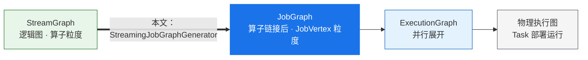
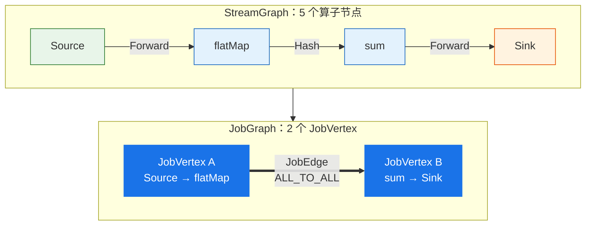
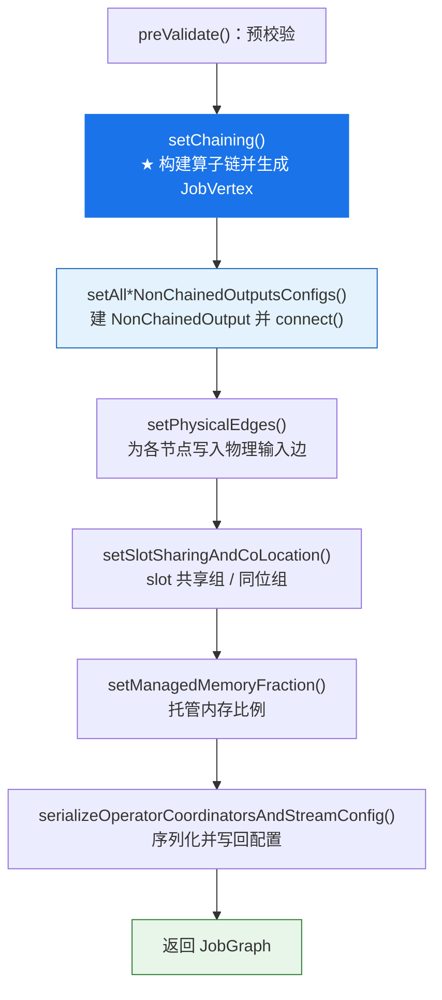
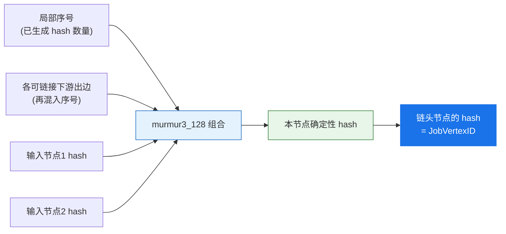
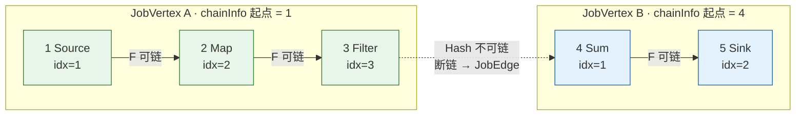
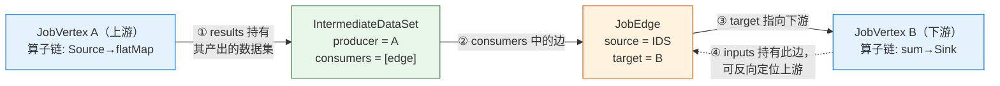
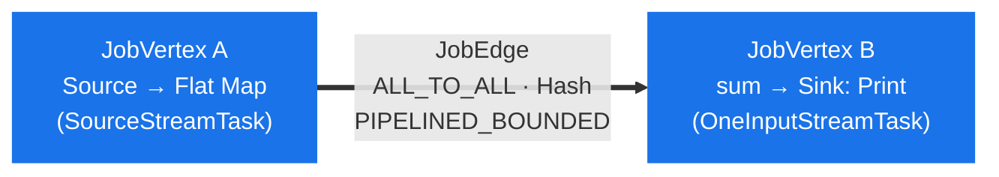

## 一、宏观：JobGraph 解决了什么问题

回顾 Flink 的四层图谱，本文处理的是从第一层到第二层的转换：



`JobGraph` 的核心优化是将多个相邻算子合并进一个 **JobVertex**（运行时按其并行度展开为多个 Task，每个 Task 在独立线程中执行整条链）。合并之后，同一条链内的算子之间以直接的方法调用传递数据，**无需序列化、不经网络**；只有在确实需要重分区（shuffle）的位置——例如 `keyBy`、`rebalance`——才会断开为两个 JobVertex，通过 `JobEdge` 连接。



整个转换在**客户端**（作业提交前）完成，产物 `JobGraph` 随后提交给 JobManager。围绕它有三条主线，构成本文骨架：

| 主线 | 做什么 | 为什么重要 | 对应章节 |
|---|---|---|---|
| **算子哈希** | 为每个节点生成确定性 hash，作为 `JobVertexID` | 作业重启 / 升级时算子身份稳定，是**状态恢复**的基础 | 第三节 |
| **算子链接** | `isChainable` 判定 + `createChain` 递归，将链头落成 JobVertex | 消除链内序列化与网络开销，是本阶段的核心 | 第四、五节 |
| **物理连接** | 不可链接的边转换为 `JobEdge` + `IntermediateDataSet` | 确定分发模式与结果分区类型，决定 shuffle 行为 | 第六节 |

---

## 二、入口与整体流程

转换入口是 `StreamingJobGraphGenerator.createJobGraph()`，由 `PipelineExecutor` 在提交作业时调用。其构造函数先完成两项准备工作，再进入主流程：

```java
// 构造函数（约 559 行，已精简）
jobGraph = createAndInitializeJobGraph(streamGraph, jobID);  // 建空 JobGraph，搬运配置 / 快照设置
// 生成确定性 hash（默认 + legacy 兼容两套）
Map<Integer, byte[]> hashes = defaultStreamGraphHasher.traverseStreamGraphAndGenerateHashes(streamGraph);
// 贯穿全程的构建上下文
this.jobVertexBuildContext = new JobVertexBuildContext(jobGraph, streamGraph, ..., hashes, ...);
```

随后 `createJobGraph()` 按固定顺序执行各步骤，下图给出主干（省略了动态图、并发执行校验等分支步骤）：



下面按三条主线逐层展开。

---

## 三、算子哈希与 JobVertexID

这一步容易被忽略，但它直接关系到一个常见的生产问题：**为什么调整拓扑后，作业就无法从 savepoint 恢复状态**。

### 3.1 为什么不能用节点 id 作为 JobVertexID

`StreamNode.id` 与 `Transformation.id` 均来自一个静态自增计数器（见上一篇）。这意味着**同一程序两次提交，节点 id 未必相同**，跨进程时更是如此。若直接以它作为 `JobVertexID`，作业一旦重启，算子身份便无法与快照中的状态对应。

Flink 的解决方案是：基于"**拓扑结构 + 算子属性**"生成确定性 hash，作为 `JobVertexID`。只要拓扑不变，hash 就不变，重启后算子即可与其状态精确对应。

### 3.2 哈希的生成方式（StreamGraphHasherV2）

遍历采用 **广度优先（BFS）**，且从**排序后的 source** 出发——因为 `getSourceIDs()` 返回顺序不稳定，排序是为了保证遍历顺序确定，进而保证 hash 确定：

```java
// traverseStreamGraphAndGenerateHashes（已精简）
List<Integer> sources = new ArrayList<>(streamGraph.getSourceIDs());
Collections.sort(sources);                 // 关键：确定性顺序
// BFS：若某节点的输入 hash 尚未就绪，则跳过，待其输入齐备后重访
while ((currentNode = remaining.poll()) != null) {
    if (generateNodeHash(currentNode, ...)) { /* 成功则将子节点入队 */ }
    else { visited.remove(currentNode.getId()); }   // 稍后重访
}
```

单个节点的 hash 分两种情况：

- **用户显式指定了 `uid`**（即 `transformationUID`）：直接对 uid 字符串做 murmur3 hash，并检测是否与已有 hash 冲突（uid 不唯一会抛异常）。
- **未指定 uid**：由 `generateDeterministicHash()` 组合三部分——① 当前已生成 hash 的数量（作为节点的局部序号，*而非* node.id）；② 每条可链接的下游出边（各再混入一次该序号）；③ 所有输入节点的 hash（以 `hash[j] = hash[j] * 37 ^ inputHash[j]` 逐字节异或合并）。

哈希函数为 `Hashing.murmur3_128(0)`。下图展示未指定 uid 时单个节点 hash 的组成：



由于 hash 由输入节点的 hash 递归合并而来，任何上游拓扑变动都会传播到下游，改变其 `JobVertexID`。这正是"未标注 uid 时，改动拓扑可能导致状态无法恢复"的根因。

> **最佳实践：** 为每个有状态算子显式设置 `uid("...")`。此时该算子的 `JobVertexID` 仅取决于 uid 字符串，**不随上下游拓扑变动而变化**，从而保证 savepoint 升级时状态稳定恢复。这也是生产作业普遍要求全程标注 uid 的原因。

---

## 四、算子链接（核心）

算子链接要回答的核心问题是：**相邻两个算子，能否合并到同一个 Task 中执行？** 本节先看判定规则（`isChainable`），再看如何据此递归构建链（`createChain`）。

### 4.1 ChainingStrategy：算子的链接策略

每个算子都带有一个链接策略 `ChainingStrategy`，默认 `ALWAYS`：

| 策略 | 含义 |
|---|---|
| `ALWAYS`（默认） | 在满足条件时尽可能与上下游链接 |
| `NEVER` | 不与任何相邻算子链接 |
| `HEAD` | 不与上游链接，但允许下游链接到它（只能作为链头） |
| `HEAD_WITH_SOURCES` | 作为链头，并额外尝试将 source 输入链入本算子 |

### 4.2 isChainable：能否链接的完整判定

入口条件很简洁：**下游算子只有一个输入边，且该输入边可链接**。

```java
public static boolean isChainable(StreamEdge edge, StreamGraph streamGraph) {
    StreamNode downStreamVertex = streamGraph.getTargetVertex(edge);
    return downStreamVertex.getInEdges().size() == 1       // 下游为单输入
            && isChainableInput(edge, streamGraph, false);
}
```

而 `isChainableInput` 要求下列条件**全部满足**，缺一不可：

| # | 条件 | 含义 / 原因 |
|---|---|---|
| 1 | `isChainingEnabled()` | 全局启用了算子链接（可通过 `disableOperatorChaining()` 关闭） |
| 2 | `isSameSlotSharingGroup()` | 上下游位于同一 slot 共享组，否则可能被调度到不同 slot，无法在同一线程执行 |
| 3 | `areOperatorsChainable()` | 链接策略相容，且并行度、maxParallelism 均相同（详见下文） |
| 4 | `arePartitionerAndExchangeModeChainable()` | 分区器为 `ForwardPartitioner` 且 `exchangeMode != BATCH` |
| 5 | 非 union | 下游每个输入位（`typeNumber`）只能被一条边占用 |

其中 `areOperatorsChainable` 的内部细则为：

- **策略相容**：上游 `NEVER` 不可链，`ALWAYS/HEAD/HEAD_WITH_SOURCES` 可链；下游 `NEVER/HEAD` 不可链，`ALWAYS` 沿用上游判定结果，`HEAD_WITH_SOURCES` 仅当上游为 source 时可链。
- **并行度相同**：`upStream.getParallelism() == downStream.getParallelism()`。
- **maxParallelism 相同**（除非显式开启"允许不同 maxParallelism 链接"的开关）。
- yielding 算子不可链接到 legacy source。

> 与上一篇呼应：`createActualEdge` 中"上下游并行度相同时默认采用 `ForwardPartitioner`"的规则，在此处发挥作用——正是 Forward 分区加并行度相同，才使这条边满足链接条件。两个阶段的设计在此闭环。

### 4.3 createChain：递归如何构建算子链

`setChaining()` 先将"可作为链式输入的 source"与"需要作为链头的 source"分开，得到一组链入口，再对每个入口调用 `createChain()` 进行深度优先递归。理解以下三个关键概念后，该递归逻辑即可厘清：

| 概念 | 作用 |
|---|---|
| `chainInfo`（链账本） | **决定算子归属哪个 JobVertex**。沿可链接边递归时*复用同一个* chainInfo；遇到不可链接边则通过 `newChain()` 开启新的 chainInfo。同一 chainInfo 内的算子最终归入同一个 JobVertex。 |
| `chainIndex` | 算子在链内的位置序号。沿可链接边递归时 `+1`；新链从 1 重新开始（0 保留给链式 source 输入）。 |
| `transitiveOutEdges` | 不可链接的出边会**向上冒泡**至链头，供后续 `connect()` 建立 JobEdge。 |

核心逻辑为三段——分类出边、沿可链接边递归、为不可链接边开启新链：

```java
// ① 分类：将当前节点的每条出边分为可链接 / 不可链接
for (StreamEdge outEdge : currentNode.getOutEdges()) {
    if (isChainable(outEdge, streamGraph)) chainableOutputs.add(outEdge);
    else nonChainableOutputs.add(outEdge);
}
// ② 可链接：复用同一 chainInfo，chainIndex + 1（仍属同一条链）
for (StreamEdge chainable : chainableOutputs) {
    transitiveOutEdges.addAll(
        createChain(chainable.getTargetId(), chainIndex + 1, chainInfo, ...));
}
// ③ 不可链接：边冒泡至链头，并为下游 newChain 开启新链
for (StreamEdge nonChainable : nonChainableOutputs) {
    transitiveOutEdges.add(nonChainable);
    createChain(nonChainable.getTargetId(), 1,
        chainEntryPoints.computeIfAbsent(nonChainable.getTargetId(),
            k -> chainInfo.newChain(nonChainable.getTargetId())), ...);
}
```

#### 示例推演

设有如下 StreamGraph（`F` 表示 Forward，可链接；`Hash` 表示 keyBy，不可链接）：

```
Source(1) --F--> Map(2) --F--> Filter(3) --Hash--> Sum(4) --F--> Sink(5)
```

按 `isChainable` 判定，`1→2`、`2→3`、`4→5` 可链接，`3→4`（keyBy）不可链接，最终应形成两条链：



递归的实际调用顺序如下（`A` 为起点 1 的 chainInfo，`B` 为起点 4 的新 chainInfo）。需注意：**递归先一路深入到底，再在回溯时创建 JobVertex**：

| # | 调用 | 当前出边 → 分类 | 动作 |
|---|---|---|---|
| 1 | `createChain(1, idx=1, A)` | `1→2` 可链 | 向下递归 ↓ |
| 2 | `createChain(2, idx=2, A)` | `2→3` 可链 | 向下递归 ↓ |
| 3 | `createChain(3, idx=3, A)` | `3→4` 不可链 | `3→4` 加入 transitiveOutEdges；**开启新链** B，递归 ↓ |
| 4 | `createChain(4, idx=1, B)` | `4→5` 可链 | 向下递归 ↓ |
| 5 | `createChain(5, idx=2, B)` | 无出边 | `setChainEnd()`；5 ≠ 起点 4 → 配置存入 `chainedConfigs[4]` |
| 6 | ↩ 回溯至 `createChain(4)` | — | 4 == 起点 4 → **`createJobVertex` 生成 B**，`setChainStart()` |
| 7 | ↩ 回溯至 `createChain(3)` | — | 3 ≠ 起点 1 → 配置存入 `chainedConfigs[1]` |
| 8 | ↩ 回溯至 `createChain(2)` | — | 2 ≠ 起点 1 → 配置存入 `chainedConfigs[1]` |
| 9 | ↩ 回溯至 `createChain(1)` | — | 1 == 起点 1 → **`createJobVertex` 生成 A**，`setChainStart()` |

> **关键点：JobVertex 在递归回溯至"链头"时才创建。** 判据是 `currentNodeId == startNodeId`——只有链的起点（步骤 6 的节点 4、步骤 9 的节点 1）会调用 `createJobVertex`；链中间节点（2、3、5）仅将各自的 `StreamConfig` 存入所属链头的 `chainedConfigs`。最终节点 `{1,2,3}` 归入 JobVertex A，`{4,5}` 归入 JobVertex B。

> **chainedConfigs 的意义：** 链上非头算子不单独构成 JobVertex，其 `StreamConfig` 被收集进链头的 `transitiveChainedTaskConfigs`，一并序列化进链头 JobVertex 的配置。运行时由 `OperatorChain` 据此还原整条算子链，在单一线程内顺序调用。

---

## 五、生成 JobVertex：算子链的落地

承接第四节，当递归回溯到链头时，`createJobVertex()` 将这条链落成一个 JobVertex：

- `JobVertexID = new JobVertexID(hash(链头))`——取自第三节生成的确定性哈希。
- 收集链上所有算子的 `OperatorIDPair`（生成 id + 用户 uid 派生 id + 算子名 + uid），运行时据此定位每个算子的状态。
- 若链中包含 InputFormat / OutputFormat，则创建 `InputOutputFormatVertex`，否则创建普通 `JobVertex`。
- `setInvokableClass(streamNode.getJobVertexClass())`——决定运行时的 Task 实现（`SourceStreamTask` / `OneInputStreamTask` / `TwoInputStreamTask` / `MultipleInputStreamTask`）。
- 设置 `parallelism` / `maxParallelism`，异步序列化算子协调器，最后 `jobGraph.addVertex(jobVertex)`。

---

## 六、物理边连接

链与链之间那些**不可链接**的边，需要转换为真正的跨 JobVertex 连接。此过程分两步：先为每条向上冒泡的 transitive 出边构建一个 `NonChainedOutput` 元信息，再由 `connect()` 将其转换为 `JobEdge`。

### 6.1 NonChainedOutput：跨网络输出的元信息

`NonChainedOutput` 描述一条跨网络输出所携带的全部信息，会被序列化进 `StreamConfig`，运行时据此创建 `RecordWriterOutput`：

| 字段 | 含义 |
|---|---|
| `dataSetId` | 对应的 IntermediateDataSet ID |
| `partitioner` | 分区器（运行时据此构建 ChannelSelector） |
| `partitionType` | 结果分区类型（PIPELINED / BLOCKING / HYBRID） |
| `consumerParallelism` / `consumerMaxParallelism` | 下游并行度，分区复用判定的依据之一 |
| `outputTag` | 侧输出标签 |
| `bufferTimeout` / `supportsUnalignedCheckpoints` | 缓冲刷新策略 / 是否支持非对齐 checkpoint |

### 6.2 ResultPartitionType 的确定

`getResultPartitionType()` 依据边的 `exchangeMode` 决定结果分区类型；当 `exchangeMode` 为 `UNDEFINED` 时，再依据全局交换模式推断：

| exchangeMode | ResultPartitionType |
|---|---|
| PIPELINED | `PIPELINED_BOUNDED` |
| BATCH | `BLOCKING` |
| HYBRID_FULL / HYBRID_SELECTIVE | 对应 HYBRID 类型 |
| UNDEFINED | 若 source 标记为 `noOutputUntilEndOfInput` 则取 BLOCKING，否则按 `globalStreamExchangeMode` 推断 |

### 6.3 connect：生成 JobEdge 与 IntermediateDataSet

对链头的每条 transitive 出边，`connect()` 调用 `downStreamVertex.connectNewDataSetAsInput(...)` 建立连接，并根据分区器是否为 pointwise 选择分发模式：

```java
if (partitioner.isPointwise()) {
    jobEdge = downStreamVertex.connectNewDataSetAsInput(
        headVertex, DistributionPattern.POINTWISE, resultPartitionType, dataSetId, ...);
} else {
    jobEdge = downStreamVertex.connectNewDataSetAsInput(
        headVertex, DistributionPattern.ALL_TO_ALL, resultPartitionType, dataSetId, ...);
}
jobEdge.setShipStrategyName(partitioner.toString());  // 供 Web UI 展示
```

| DistributionPattern | 典型分区器 | 含义 |
|---|---|---|
| `POINTWISE` | Forward / Rescale（pointwise） | 上下游子任务点对点连接 |
| `ALL_TO_ALL` | Hash（keyBy）/ Rebalance / Broadcast | 每个上游子任务连接所有下游子任务 |

最后由 `setPhysicalEdges()` 将所有物理边按目标节点分组，写入各节点的 `StreamConfig.setInPhysicalEdges`，供运行时构建输入门（InputGate）。JobVertex、JobEdge、IntermediateDataSet 三者的具体字段与连接关系，将在第九节集中说明。

---

## 七、深入：分区复用与 Hybrid Shuffle

第六节提到的 BLOCKING / HYBRID 分区类型，主要服务于批处理与动态图场景。本节深入其背后的两项优化：分区复用与 Hybrid Shuffle。先厘清 `ResultPartitionType` 的几个关键维度。

### 7.1 ResultPartitionType 全景

| 类型 | 消费约束 | 可重复消费<br/>(reconsumable) | 说明 |
|---|---|---|---|
| `PIPELINED` | 必须流式消费 | 否 | 边产出边消费，单消费者、消费一次，in-flight 数据量不设上限 |
| `PIPELINED_BOUNDED` | 必须流式消费 | 否 | 流作业默认类型，本地缓冲池有界，避免 checkpoint barrier 被积压数据拖慢 |
| `PIPELINED_APPROXIMATE` | 可流式消费 | 否 | 用于近似本地恢复，下游失败后可重连 |
| `BLOCKING` | 上游完成后才消费 | 是 | 批处理专用，全量产出后再消费，可多次、并发消费 |
| `BLOCKING_PERSISTENT` | 同 BLOCKING | 是 | 生命周期由用户 API 控制 |
| `HYBRID_FULL` | 可流式消费 | 是 | 边写边读且全量落盘，可重复消费，failover 时避免上游重算 |
| `HYBRID_SELECTIVE` | 可流式消费 | 否 | 与 HYBRID_FULL 类似，但不保证可重复消费 |

Hybrid Shuffle 是批场景下的一种折衷：它既像 pipelined 一样允许下游在上游尚未完全产出时即开始消费（提升吞吐），又像 blocking 一样将数据落盘（具备容错与重复消费能力）。其中 `HYBRID_FULL` 可重复消费，`HYBRID_SELECTIVE` 则不保证。

### 7.2 分区复用（createOrReuseOutput）

当同一算子的多条下游边分区特征一致时，无需为每条边各建一个独立的结果分区，而可以**复用同一个 `NonChainedOutput`**，从而降低 shuffle 数据的写出成本。复用的前提（见 `createOrReuseOutput`）：

- 分区类型可复用：`isReconsumable()` 为真（如 BLOCKING），或属于 hybrid 分区。
- 候选 output 与当前边的 **partitioner、consumerParallelism、consumerMaxParallelism、persistentDataSetId、outputTag 全部相同**。

```java
if (isPartitionTypeCanBeReuse(partitionType)) {            // reconsumable 或 hybrid
    for (NonChainedOutput candidate : outputsConsumedByEdge.values()) {
        if (allHybridOrSameReconsumablePartitionType(candidate.getPartitionType(), partitionType)
                && consumerParallelism == candidate.getConsumerParallelism()
                && consumerMaxParallelism == candidate.getConsumerMaxParallelism()
                && Objects.equals(candidate.getPersistentDataSetId(), edge.getIntermediateDatasetIdToProduce())
                && Objects.equals(candidate.getOutputTag(), edge.getOutputTag())
                && Objects.equals(edge.getPartitioner(), candidate.getPartitioner())) {
            reusableOutput = candidate;                    // 命中：复用
            checkAndReplaceReusableHybridPartitionType(reusableOutput);
            break;
        }
    }
}
```

其中有两个值得注意的优化：

- **HYBRID_SELECTIVE → HYBRID_FULL 升级**：由于复用要求可重复消费，一旦某个 hybrid_selective 分区将被复用，`checkAndReplaceReusableHybridPartitionType` 会将其替换为 hybrid_full，并采用全量落盘策略以降低写出成本。
- **广播优化**：broadcast 的 hybrid_selective 分区同样会被替换为 hybrid_full，以显著减少 shuffle 数据的写出。

### 7.3 动态图下的分区器转换

在动态图（AdaptiveBatch）下，并行度可能在运行时才确定，因此上一篇提到的"占位"分区器需在成图时转换（见 `tryConvertPartitionerForDynamicGraph`）：

- 可链接边上的 `ForwardForConsecutiveHashPartitioner` / `ForwardForUnspecifiedPartitioner` → 转回 `ForwardPartitioner`；
- 不可链接边上的 `ForwardForUnspecifiedPartitioner` → 转为 `RescalePartitioner`（pointwise，以适应并行度变化）。

> ⚠️ **约束：** Hybrid Shuffle 仅支持批作业——`validateHybridShuffleExecuteInBatchMode` 在检测到 hybrid 分区却非 BATCH 模式时会抛异常；此外，hybrid 模式下不允许设置非默认的 slot 共享组。

---

## 八、收尾：Slot 共享、同位约束与托管内存

JobVertex 与边全部建立后，还需补齐调度与资源相关信息：

- **setSlotSharing**：默认按 *pipelined region* 划分 `SlotSharingGroup`（同一 region 内的 JobVertex 共享 slot）；若 `allVerticesInSameSlotSharingGroupByDefault` 为真，则所有 region 归入同一组（流作业默认如此）。用户显式指定组名时，则采用指定组。
- **setCoLocation**：按 `coLocationGroupKey` 设置同位约束（要求上下游位于同一 slot 共享组，常用于迭代作业）。
- **setManagedMemoryFraction**：以 slot 共享组为单位，聚合组内各算子的托管内存用例权重，计算每个算子应占的内存比例（fraction）。
- **markSupportingConcurrentExecutionAttempts**：只要链内存在任一算子不支持并发执行尝试，整个 JobVertex 便关闭该能力。
- **serializeOperatorCoordinatorsAndStreamConfig**：通过线程池并行序列化算子协调器与 StreamConfig，并写回各 JobVertex。

---

## 九、关键数据结构：JobVertex 与 JobEdge 如何串联

本节的重点不是罗列字段，而是回答两个核心问题：**算子链的逻辑存放在何处？** 以及**一个 JobVertex 的上下游如何被找到？** 先给出结论：

> **两个 JobVertex 之间并不直接相连**，而是隔着两层：上游的输出数据集 `IntermediateDataSet`，以及连接边 `JobEdge`。数据流向为：
> `上游 JobVertex —产出→ IntermediateDataSet —被消费→ JobEdge —指向→ 下游 JobVertex`。



### 9.1 JobVertex：算子链的逻辑就承载于此

既然 JobVertex 代表一条算子链，那么链的处理逻辑存放在何处？答案是：**不存在单独的结构，它就分布在 JobVertex 自身的字段中。**

| 字段 | 含义 | 承担链的哪一部分 |
|---|---|---|
| `operatorIDs: List<OperatorIDPair>` | 链中所有算子的 ID，按**深度优先后序**排列（与运行时 StreamTask 内算子的执行顺序一致） | 确定"链中包含哪些算子、以何种顺序排列" |
| `configuration: Configuration` | 本质是一个 `StreamConfig`；链头配置通过 `transitiveChainedTaskConfigs` 内嵌了链上其余算子的 StreamConfig（含算子工厂、序列化器、chainIndex、chainStart/End） | 确定"每个算子如何实例化、如何串成 pipeline" |
| `invokableClassName` | 运行时 TaskManager 实例化的 `StreamTask` 子类（SourceStreamTask / OneInputStreamTask 等） | 运行时读取上述两者，重建 `OperatorChain`，在**单一线程**内按序驱动整条链 |
| `inputs: List<JobEdge>` | 本 JobVertex 的全部输入边 | 定位上游：每条 JobEdge 的 `source` 即为上游的输出数据集 |
| `results: Map<id, IntermediateDataSet>` | 本 JobVertex 产出的输出数据集 | 定位下游：数据集 `consumers` 中的边指向下游 |
| `parallelism / slotSharingGroup / JobVertexID` | 并行度 / slot 共享组 / 稳定标识 | 供调度与状态恢复使用 |

> 因此，"算子链的处理逻辑"在**构建期**体现为 `operatorIDs` 加上序列化进 `configuration` 的一组 StreamConfig；在**运行期**由 `invokableClass`（StreamTask）读出并还原为 `OperatorChain`。JobVertex 本身只是"一个 Task 的静态蓝图"，不含运行逻辑。

### 9.2 IntermediateDataSet：上下游之间的桥梁

为何不让两个 JobVertex 直接相连？因为一个算子的输出可能被多个下游消费，且需在物理层面对应到"结果分区"。`IntermediateDataSet` 正是这一中间产物：

- `producer: JobVertex` —— 由谁产出（上游）。
- `consumers: List<JobEdge>` —— 由谁消费（可为多个下游）。
- `resultType: ResultPartitionType` —— PIPELINED / BLOCKING / HYBRID，决定消费方式。
- `id: IntermediateDataSetID` —— 运行时对应为 `IntermediateResult` 及其分区。

### 9.3 JobEdge：连接边

`JobEdge` 一端连接数据集、另一端连接下游顶点，其字段直接体现"数据从何而来、流向何处、如何分发"：

- `source: IntermediateDataSet` —— 上游的输出数据集（*而非*上游 JobVertex，需经数据集的 `producer` 才能取得上游顶点）。
- `target: JobVertex` —— 下游顶点。
- `distributionPattern` —— POINTWISE / ALL_TO_ALL，决定上下游子任务的连接方式。
- `isForward / isBroadcast / shipStrategyName` —— 分发细节（其中 shipStrategyName 用于 Web UI 展示）。

### 9.4 三者如何被连接起来

第六节的 `connect()` 最终调用 `下游.connectNewDataSetAsInput(上游, ...)`，通过四步将三者连接在一起：

```java
public JobEdge connectNewDataSetAsInput(JobVertex input, ...) {
    // ① 令上游产出（或复用）一个输出数据集
    IntermediateDataSet dataSet = input.getOrCreateResultDataSet(dataSetId, partitionType);
    // ② 建边：source = 上游数据集，target = this（下游自身）
    JobEdge edge = new JobEdge(dataSet, this, distPattern, ...);
    // ③ 下游将此边记入自身的 inputs
    this.inputs.add(edge);
    // ④ 上游数据集将此边记入自身的 consumers
    dataSet.addConsumer(edge);
    return edge;
}
```

连接完成后，图即可**双向导航**：

- **向下游遍历**：`JobVertex.results` → `IntermediateDataSet.consumers` → `JobEdge.target`（下游 JobVertex）。
- **向上游遍历**：`JobVertex.inputs` → `JobEdge.source` → `IntermediateDataSet.producer`（上游 JobVertex）。

### 9.5 构建期辅助结构（了解即可）

以下结构不进入最终的 JobGraph，仅作为构建过程中的"脚手架"：

| 结构 | 角色 |
|---|---|
| `StreamConfig` | 算子配置的载体，最终序列化进 `JobVertex.configuration`；运行时据此还原算子链 |
| `OperatorChainInfo` | 单条链的构建账本：链头、链节点、chainedConfigs、hashes、transitiveOutEdges（见第四节） |
| `JobVertexBuildContext` | 贯穿全程的构建上下文：持有 jobGraph、streamGraph、hashes、按序的 JobVertex、物理边等 |
| `NonChainedOutput` | 不可链接边的输出元信息，`connect()` 据此建立 JobEdge 与 IntermediateDataSet（见第六节） |

---

## 十、完整示例：WordCount 的 JobGraph

承接上一篇生成的 StreamGraph：

```
Source(1) --Forward--> flatMap(2) --Hash(keyBy)--> sum(4) --Forward--> Sink/print(5)
```

逐条边套用 `isChainable` 判定：

1. `Source(1) → flatMap(2)`：Forward、并行度相同、下游单输入、策略 ALWAYS → **可链接**，合并为 **JobVertex A**。
2. `flatMap(2) → sum(4)`：keyBy 为 Hash 分区，非 Forward → **不可链接**，断开为 `JobEdge`（`ALL_TO_ALL`，PIPELINED_BOUNDED）。
3. `sum(4) → Sink(5)`：Forward、并行度相同 → **可链接**，合并为 **JobVertex B**。



最终 JobGraph 为：**两个 JobVertex + 一条 ALL_TO_ALL 的 JobEdge**。`keyBy` 所在位置既是算子链的断点，也是 shuffle 的边界——这正是"链接持续到 Forward 边为止、遇到重分区即断开"的直接体现。

---

## 十一、小结

从 StreamGraph 到 JobGraph，本质是将"算子级逻辑图"压缩为"可调度的执行蓝图"。核心要点如下：

1. **算子链接是核心机制**：需同时满足 Forward 分区、并行度与 maxParallelism 相同、同一 slot 共享组、下游单输入、链接策略允许、非 union，方可将相邻算子合并进同一个 Task，从而省去序列化与网络开销。
2. **确定性哈希保证算子身份稳定**：`JobVertexID` 源自"拓扑 + 属性"的 murmur3 hash 或用户 uid；显式标注 `uid()` 是保证状态可恢复的最佳实践。
3. **不可链接的边转换为物理连接**：经 `NonChainedOutput` → `connect()` 生成 `JobEdge` 与 `IntermediateDataSet`，分发模式与结果分区类型在此确定。
4. **批处理与动态图的进阶优化**：BLOCKING / Hybrid 分区、分区复用、hybrid_selective → full 升级、动态图分区器转换，均服务于吞吐与容错。

JobGraph 提交给 JobManager 后，将被进一步展开为并行的 `ExecutionGraph`（每个 JobVertex 按并行度展开为多个 ExecutionVertex），再调度部署至 TaskManager 执行。那是本系列的下一站。