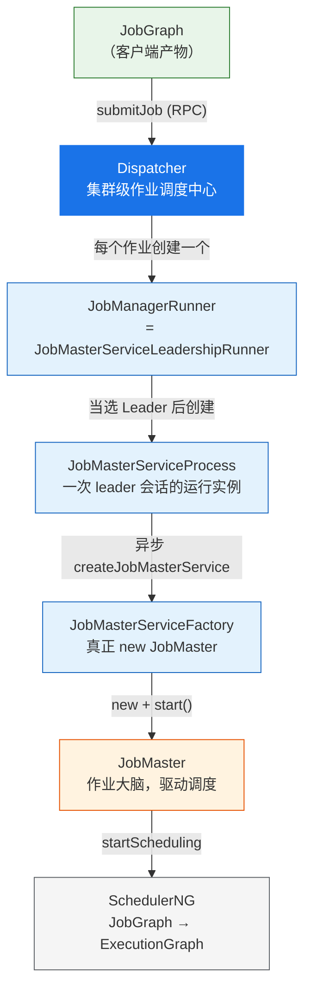
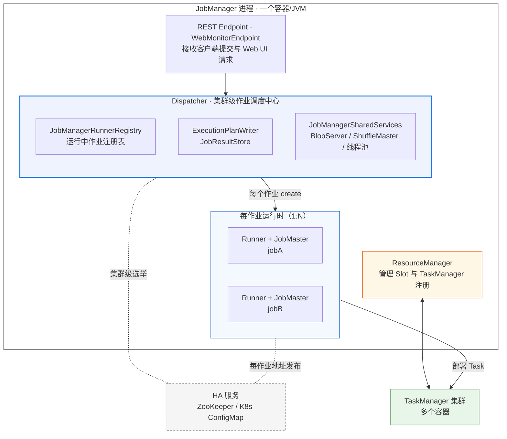
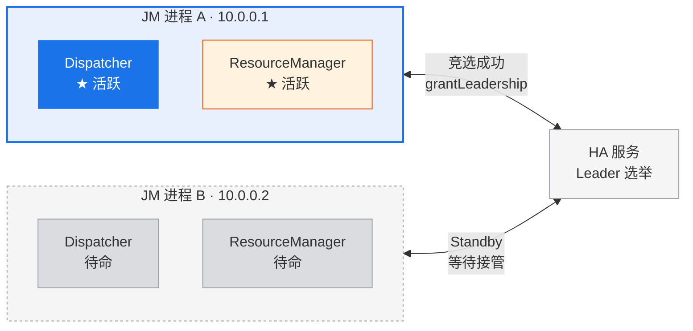
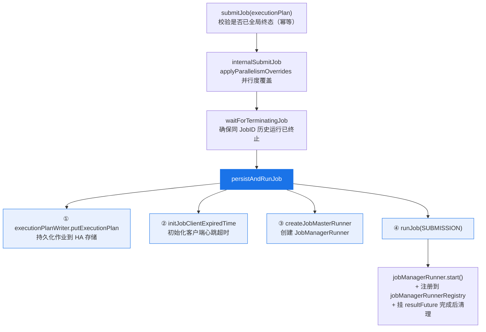

## 一、宏观：一条主链与五个角色

从 JobGraph 提交到 JobMaster 开始调度，代码上跨越了五个关键角色：



| 角色 | 类 | 解决的问题 |
|---|---|---|
| 集群级入口 | `Dispatcher` | 一个集群一个（Leader）：接收提交、持久化作业、为每个作业分配一套运行时、管理生命周期 |
| 每作业运行时管理 | `JobMasterServiceLeadershipRunner` | 为单个作业管理 JobMaster 的**生命周期、地址发布与 fencing**：向上给 Dispatcher 一个稳定句柄，向下负责创建/重建 JobMaster、发布其 RPC 地址（供 TaskManager 直连）、签发 fencing token。它也承载每作业的 Leader 选举，但该能力仅在 HA 故障切换时才真正起作用（见第四节） |
| 一次运行尝试 | `JobMasterServiceProcess` | 代表"在某个 leaderSessionId 下运行一次 JobMasterService"，封装 JobMaster 的**异步创建**与**初始化失败**处理 |
| 构建者 | `JobMasterServiceFactory` | 真正 `new JobMaster(...)` 并 `start()`，把重活放到独立线程异步执行 |
| 作业大脑 | `JobMaster` | 单作业核心：持有 SchedulerNG / SlotPoolService / 心跳等，负责实际调度执行 |

> 一句话概括职责边界：**Dispatcher 管"集群与作业分配"，Runner 管"每作业 JobMaster 的寻址、fencing 与生命周期"，Process 管"一次运行尝试与异步初始化"，Factory 管"构建并启动"，JobMaster 管"实际调度"。**

---

## 二、JobManager 进程架构与选主

在讲提交路径之前，需先建立 JobManager 进程级的架构认知：**Dispatcher、ResourceManager、各 JobMaster 都住在 JobManager 进程内**；HA 的冗余体现在**多个 JobManager 进程（主备）**，不是多个 Dispatcher 或多个 JobMaster 热备。

### 2.1 单个 JobManager 进程的内部结构



### 2.2 多 JobManager 进程的选主过程

HA 部署下，会运行**多个 JobManager 进程**（如 Kubernetes 多副本 / Standalone HA 双节点）。它们通过 `HighAvailabilityServices`（ZooKeeper 或 K8s Leader 选举）竞选：



选主规则与流程：

1. 各 JM 进程启动时，通过 `DispatcherRunner`（实现 `LeaderContender`）参与集群级 Leader 选举。
2. HA 服务对所有 contender 进行仲裁，只向**一个**发出 `grantLeadership(sessionId)`；其余进程保持 standby。
3. 胜出进程的 Dispatcher 触发 `onStart()`：恢复作业、接受新提交；ResourceManager 同理各自激活。
4. 若 Leader 进程故障 → HA 服务检测到并回调备用进程 `grantLeadership` → 新 Leader 的 Dispatcher 从 HA 存储恢复全部作业。

> **关键理解：** ① Flink 的 HA 不是"多活"，而是"主备 + 快速接管"；② 冗余在**进程**这一级（多个 JM 进程），不在组件这一级（不存在多个 Dispatcher 或多个 JobMaster 同时跑同一个作业）；③ 持久化（JobGraph / checkpoint 元数据存 HA 存储）是故障恢复的数据基础。

---

## 三、提交路径：Dispatcher 侧的处理

客户端通过 `DispatcherGateway.submitJob(ExecutionPlan)` 发起 RPC（`JobGraph` 是 `ExecutionPlan` 的实现）。Dispatcher 侧的处理链条如下：



核心方法 `persistAndRunJob`（约 705 行）逻辑精简如下：

```java
private void persistAndRunJob(ExecutionPlan executionPlan) throws Exception {
    executionPlanWriter.putExecutionPlan(executionPlan);      // ① 持久化到 HA，为故障恢复兜底
    initJobClientExpiredTime(executionPlan);                  // ② 客户端心跳
    JobManagerRunner jobMasterRunner = createJobMasterRunner(executionPlan);  // ③ 创建 Runner
    runJob(jobMasterRunner, ExecutionType.SUBMISSION);        // ④ 启动
}

private void runJob(JobManagerRunner jobManagerRunner, ExecutionType executionType) {
    jobManagerRunner.start();                                 // 进入 Leader 选举
    jobManagerRunnerRegistry.register(jobManagerRunner);      // 登记到运行中作业表
    // 挂接 resultFuture：作业完成/失败 → removeJob + 资源清理
    ...
}
```

> **关键点：先持久化，再运行。** `putExecutionPlan` 会把 JobGraph 写入 HA 存储（ZooKeeper / K8s）。这样即使 Dispatcher（JobManager）随后故障，新的 Leader 上任时也能从 HA 存储恢复该作业——这正是 Dispatcher 生命周期中 `startRecoveredJobs()` 的数据来源。

`createJobMasterRunner` 通过 `jobManagerRunnerFactory.createJobManagerRunner(...)` 创建 Runner，实际返回的实现类是 `JobMasterServiceLeadershipRunner`。至此，控制权从 Dispatcher 交到了"每作业 Runner"手中。

---

## 四、JobMaster 的创建：每作业运行时的管理

`JobMasterServiceLeadershipRunner` 同时实现 `JobManagerRunner` 与 `LeaderContender`。它为单个作业管理 JobMaster 的**生命周期、地址发布与 fencing**：向上给 Dispatcher 暴露一个稳定的句柄，向下负责在合适时机创建/重建 JobMaster、发布其 RPC 地址、签发 fencing token。

### 4.1 start：注册为 LeaderContender

```java
public void start() throws Exception {
    leaderElection.startLeaderElection(this);   // 把自己作为 LeaderContender 注册
}
```

这里的 `leaderElection` 来自 `haServices.getJobManagerLeaderElection(jobId)`——是一份**按作业 ID 隔离**的选举句柄（与 Dispatcher 的集群级选举相互独立）。当选后其 `grantLeadership(sessionId)` 被回调，Runner 才真正创建 JobMaster。

> ⚠️ **不要被"选举"二字误导。** Flink 的 Dispatcher 恒为**单活**（active-standby），因此在正常运行时这份"每作业选举"是**退化**的——Runner 并不在与其它候选 JobMaster 竞争。那它为什么仍然存在？因为它承担的是三件与"竞争"无关、却始终需要的职责：

- **① 地址发布（服务发现）：** TaskManager 是**直连 JobMaster** 的（offer slot、心跳），不经过 Dispatcher。Runner 通过 `confirmLeadership(sessionId, address)` 把 JobMaster 的 RPC 地址写到 HA 存储的每作业路径，TaskManager 再经 leader retrieval 发现并连上。无论集群有几个 Dispatcher，这件事都必须有人做。
- **② fencing token：** 当选拿到的 `leaderSessionId` 即 JobMaster 的 `JobMasterId`。JobMaster 一旦被重建（进程内重启或故障切换后新建）会拿到新 token，TaskManager 只认当前 token，从而拒绝僵尸 JobMaster——防脑裂。
- **③ 统一的生命周期封装：** 把 JobMaster 的异步创建、初始化失败、干净停止/重建封装为稳定的 `JobManagerRunner` 句柄；且 HA 开与不开走**同一套代码路径**（非 HA 时底层选举是"立即授予"的平凡实现）。

> "选举"这个能力真正起作用的场景只有一个：**HA 故障切换的重叠窗口**——旧 JobManager 进程尚未完全退出、新进程已经起来时，靠每作业 leadership + fencing 保证只有新 JobMaster 生效。除此之外，Runner 的价值都体现在上面三点，而非"选主竞争"。

### 4.2 grantLeadership：当选后异步创建 Process

当选后触发 `grantLeadership(leaderSessionID)` → `startJobMasterServiceProcessAsync`。所有 leadership 操作通过 `sequentialOperation` 串行化，避免授予/撤销交错：

```java
// 先查作业是否早已完成（HA 存储里已有结果）
jobResultStore.hasJobResultEntryAsync(getJobID())
    .thenCompose(hasJobResult -> {
        if (hasJobResult) {
            return handleJobAlreadyDoneIfValidLeader(leaderSessionId);   // 已完成：直接以成功收尾
        } else {
            return createNewJobMasterServiceProcessIfValidLeader(leaderSessionId);  // 正常：创建 Process
        }
    });
```

`createNewJobMasterServiceProcess`（约 314 行）做三件事：

1. 通过 `jobMasterServiceProcessFactory.create(leaderSessionId)` 创建 `DefaultJobMasterServiceProcess`；
2. 把 Process 的 `jobMasterGatewayFuture` / `resultFuture` **转发**到 Runner 的对应 future（且仅当仍是有效 leader 时）；
3. `confirmLeadership`：拿到 leader 地址后向选举服务确认 leadership。

> ⚠️ `leaderSessionId` 会成为 JobMaster 的 `JobMasterId`（fencing token）。这意味着"过期 leader"发出的 RPC 会因 token 不匹配被拒绝，从而防止脑裂（split-brain）——这是 `FencedRpcEndpoint` 的核心作用。

---

## 五、Process 与 Factory：异步构建 JobMaster

### 5.1 JobMasterServiceProcess：封装异步创建与初始化失败

`DefaultJobMasterServiceProcess` 在**构造时**就发起 JobMaster 的异步创建，并根据结果推进不同的 future：

```java
// 构造函数中
this.jobMasterServiceFuture =
        jobMasterServiceFactory.createJobMasterService(leaderSessionId, this);  // 异步

jobMasterServiceFuture.whenComplete((jobMasterService, throwable) -> {
    if (throwable != null) {
        // 初始化失败：包成一个失败的 ArchivedExecutionGraph
        resultFuture.complete(JobManagerRunnerResult.forInitializationFailure(...));
    } else {
        // 成功：complete gateway/address future，并监听意外终止
        registerJobMasterServiceFutures(jobMasterService);
    }
});
```

Process 的价值在于：JobMaster 是**异步**创建的、且创建可能**失败**。Process 把这两种情况统一封装，向上层 Runner 暴露一致的 `resultFuture` 与 `jobMasterGatewayFuture`。作业到达全局终态时，通过 `jobReachedGloballyTerminalState` 让 `resultFuture` 以成功完成。

### 5.2 JobMasterServiceFactory：真正 new JobMaster

`DefaultJobMasterServiceFactory` 把"构建 + 启动 JobMaster"的重活放到独立线程：

```java
public CompletableFuture<JobMasterService> createJobMasterService(UUID leaderSessionId, OnCompletionActions actions) {
    return CompletableFuture.supplyAsync(
        () -> internalCreateJobMasterService(leaderSessionId, actions),   // 独立线程执行
        executor);
}

private JobMasterService internalCreateJobMasterService(UUID leaderSessionId, OnCompletionActions actions) {
    final JobMaster jobMaster = new JobMaster(
        rpcService, JobMasterId.fromUuidOrNull(leaderSessionId),   // leaderSessionId → fencing token
        jobMasterConfiguration, ResourceID.generate(), executionPlan,  // executionPlan 即 JobGraph
        haServices, slotPoolServiceSchedulerFactory, jobManagerSharedServices,
        heartbeatServices, ..., shuffleMaster, ...);
    jobMaster.start();     // 启动 RPC 端点，触发 onStart()
    return jobMaster;
}
```

---

## 六、JobMaster 的启动与调度

`JobMaster` 是一个 `FencedRpcEndpoint<JobMasterId>`。`start()` 会触发 RPC 端点的 `onStart()`，进入作业执行准备：
