---
math: true
pin: true
mermaid: true

title:    Flink 源码 | 从 JobGraph 到 ExecutionGraph：并行展开与物理执行图的构建
date:     2026-07-13
author:   Aiden
image: 
  path : source/internal/data-stream.jpg
categories : ['分布式']
tags : ['计算引擎']

--- 
> 基于 Apache Flink 2.2.0 源码分析 · SchedulerNG 线：JobVertex 如何按并行度展开为 ExecutionVertex

> **版本与模块说明：** 本文基于 Apache Flink 2.2.0。相关类分布于 flink-runtime 模块的 `org.apache.flink.runtime.scheduler` 与 `org.apache.flink.runtime.executiongraph` 包。本文承接《从 JobGraph 到 JobMaster》，聚焦 `SchedulerNG` 这条线，讲清 JobGraph 如何展开成 ExecutionGraph。文中行号为 2.2.0 源码的近似位置。

前一篇我们看到 JobMaster 启动后把控制权交给了 `SchedulerNG.startScheduling()`。但在调度真正开始之前，还有一个关键动作已经悄悄完成了：**把 JobGraph 展开成 ExecutionGraph**。这是 Flink 四层图谱里承上启下的一层——从"算子链粒度的逻辑图"变成"并行子任务粒度的物理执行图"。本文按源码逐层拆解这个展开过程。

## 一、宏观：ExecutionGraph 是什么、何时构建

回顾四层图谱，本文处理的是从第二层到第三层的转换：

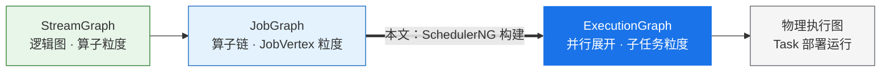

**核心作用：** JobGraph 里的 `JobVertex` 是"算子链"粒度的——一个 JobVertex 并行度是 4，也只是一个节点。而运行时需要 4 个并行子任务实例。ExecutionGraph 就是把每个 JobVertex 按并行度**展开**成多个 `ExecutionVertex`（子任务），并把它们之间的数据传输关系落成物理连接，为调度部署做好准备。

### 1.1 ExecutionGraph 的内部结构总览

> **一个容易误解的时机问题：** ExecutionGraph **不是**在 `startScheduling()` 时才构建，而是在 **SchedulerNG（`SchedulerBase`）构造时**就已经建好。`startScheduling()` 做的是之后的"申请 Slot + 部署 Task"。换言之，"JobGraph → ExecutionGraph"是**创建 Scheduler 的副产物**。

构建的触发链如下：

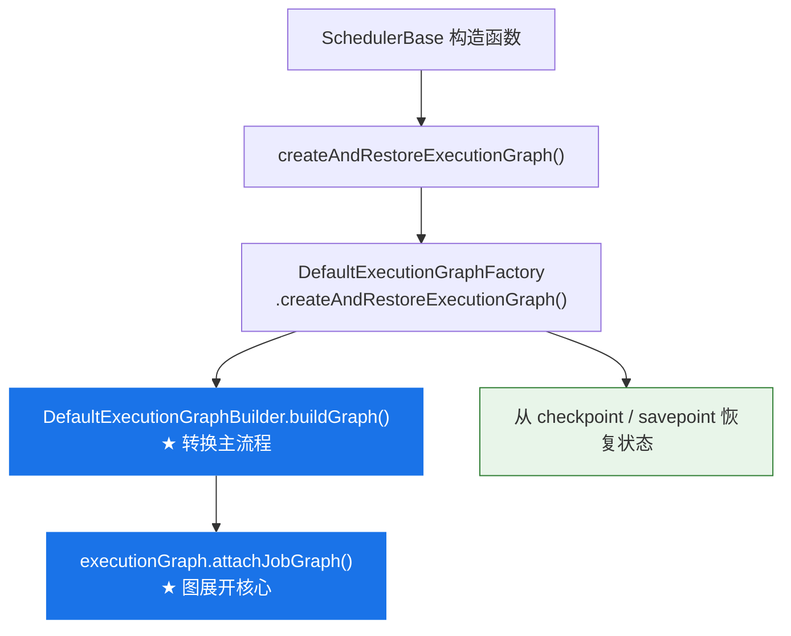

## 二、buildGraph：搭空图与附加

`DefaultExecutionGraphBuilder.buildGraph()` 是转换的主流程。它先搭一个空的 ExecutionGraph，再把拓扑排序后的 JobVertex 附加上去：

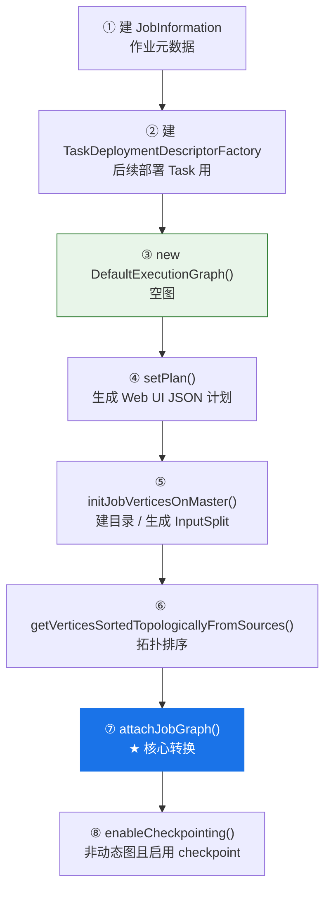

为什么第 ⑥ 步要**拓扑排序**？因为第 ⑦ 步连边时，下游顶点需要按 ID 找到上游已经创建好的中间结果（`IntermediateResult`）。只有保证"上游先处理"，连边才不会落空。

```java
// buildGraph 关键片段（已精简）
final DefaultExecutionGraph executionGraph = new DefaultExecutionGraph(...);   // 空图
executionGraph.setPlan(JsonPlanGenerator.generatePlan(jobGraph));              // Web UI 计划
initJobVerticesOnMaster(jobGraph.getVertices(), ...);                          // master 初始化钩子
List<JobVertex> sortedTopology = jobGraph.getVerticesSortedTopologicallyFromSources();
executionGraph.attachJobGraph(sortedTopology, jobManagerJobMetricGroup);       // 核心转换
if (!isDynamicGraph && isCheckpointingEnabled(jobGraph)) {
    executionGraph.enableCheckpointing(...);                                   // 配置 checkpoint
}
return executionGraph;
```

## 三、attachJobGraph：两趟处理

`DefaultExecutionGraph.attachJobGraph()` 分两趟走：先把所有 JobVertex 变成"空壳" ExecutionJobVertex 并登记，再逐个填充。

```java
public void attachJobGraph(List<JobVertex> verticesToAttach, ...) {
    attachJobVertices(verticesToAttach, ...);      // 第 1 趟：JobVertex → 空壳 ExecutionJobVertex
    if (!isDynamic) {
        initializeJobVertices(verticesToAttach);   // 第 2 趟：填充（动态图延迟到运行时）
    }
    executionTopology = DefaultExecutionTopology.fromExecutionGraph(this);  // 调度拓扑 / pipelined region
    partitionGroupReleaseStrategy = ...;
}
```

> **为什么分两趟？** 第 1 趟先把所有 `ExecutionJobVertex` 建好并登记到 `tasks` map；第 2 趟连边时才能按 `IntermediateDataSetID` 找到上游顶点产出的 `IntermediateResult`。若边建边连，遇到尚未创建的上游就会失败。

- **第 1 趟 `attachJobVertices`：** 遍历拓扑序，每个 `JobVertex` → 一个空壳 `ExecutionJobVertex`（此时**还没有 ExecutionVertex**），放进 `tasks`。
- **第 2 趟 `initializeJobVertices`：** 对每个空壳调 `initializeJobVertex` 完成并行展开与连边（下一节详解）。

## 四、initializeJobVertex：并行展开（核心）

这是整个转换的心脏。`initializeJobVertex` 把一个"空壳" ExecutionJobVertex 填充为完整的可执行结构：

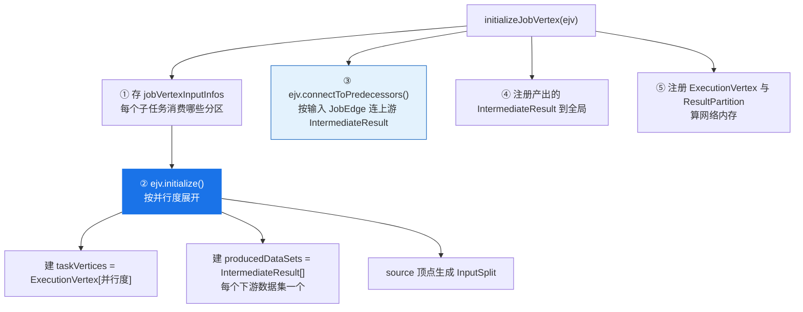

### 4.1 ejv.initialize：裂成子任务与分区

```java
// ExecutionJobVertex.initialize（约 177 行，已精简）
this.taskVertices = new ExecutionVertex[parallelismInfo.getParallelism()];              // N 个子任务
this.producedDataSets = new IntermediateResult[jobVertex.getNumberOfProducedIntermediateDataSets()];

for (int i = 0; i < jobVertex.getProducedDataSets().size(); i++) {                       // 每个下游数据集
    IntermediateDataSet result = jobVertex.getProducedDataSets().get(i);
    this.producedDataSets[i] = new IntermediateResult(result, this, parallelism, ...);   // → IntermediateResult
}
for (int i = 0; i < parallelism; i++) {                                                  // 逐个建子任务
    taskVertices[i] = createExecutionVertex(this, i, producedDataSets, ...);
}
```

### 4.2 ExecutionVertex 构造：建输出分区与执行尝试

```java
// ExecutionVertex 构造函数（约 108 行，已精简）
for (IntermediateResult result : producedDataSets) {
    IntermediateResultPartition irp =
        new IntermediateResultPartition(result, this, subTaskIndex, edgeManager);   // 该子任务的输出分区
    result.setPartition(subTaskIndex, irp);
    resultPartitions.put(irp.getPartitionId(), irp);
}
this.currentExecution = createNewExecution(createTimestamp);   // 一次执行尝试
getExecutionGraphAccessor().registerExecution(currentExecution);
```

每个 `ExecutionVertex`（子任务）为它要产出的每个 `IntermediateResult` 建一个 `IntermediateResultPartition`（该子任务的输出分区），并建一个 `Execution`（代表一次执行尝试，attemptNumber 从 0 起）。

### 4.3 connectToPredecessors：连上游

```java
// 对每条输入 JobEdge，按 ID 找到上游 IntermediateResult 并连边
for (JobEdge edge : jobVertex.getInputs()) {
    IntermediateResult ires = intermediateDataSets.get(edge.getSourceId());  // 上游数据集
    this.inputs.add(ires);
    EdgeManagerBuildUtil.connectVertexToResult(this, ires);                  // 连边（见第六节）
}
```

## 五、层级展开与数据结构

展开的本质是一组 1:N 的裂变。下图和表格是本文最该记住的内容：

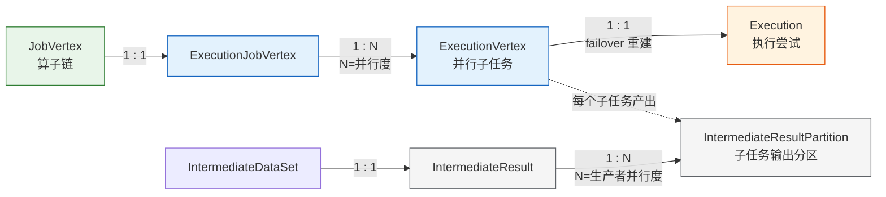

| JobGraph 侧（逻辑） | ExecutionGraph 侧（物理并行） | 关系 |
|-------------------|---------------------------|------|
| `JobVertex`（一条算子链） | `ExecutionJobVertex` | 1 : 1 |
| — | `ExecutionVertex`（一个并行子任务） | 1 EJV : N（N = 并行度） |
| — | `Execution`（一次执行尝试） | 1 EV : 1（failover 时 attempt+1 重建） |
| `IntermediateDataSet` | `IntermediateResult` | 1 : 1 |
| — | `IntermediateResultPartition`（子任务输出分区） | 1 IR : N（N = 生产者并行度） |
| `JobEdge` | 由 EdgeManager 分组结构表达（见第六节） | — |

> 记忆口诀：**"顶点按并行度裂成子任务，数据集按生产者并行度裂成分区。"** Execution 则是子任务的"一次执行尝试"——failover 时 `ExecutionVertex.resetForNewExecution()` 会新建一个 Execution（attemptNumber+1），而 ExecutionVertex 本身不变。

## 六、边的连接：分组结构而非对象化边

连边由 `EdgeManagerBuildUtil.connectVertexToResult` 按 `DistributionPattern` 分流（这两种模式正是上一篇 JobEdge 里确定的）：

| DistributionPattern | 典型来源 | 连接方式 |
|--------------------|---------|---------|
| `POINTWISE` | Forward / Rescale | 上下游子任务点对点 / 按区间连接 |
| `ALL_TO_ALL` | Hash(keyBy) / Rebalance / Broadcast | 每个下游子任务连接所有上游分区 |

> **关键设计（Flink 1.13+）：不再为每条子任务间的边创建 `ExecutionEdge` 对象。** 全连接下边数是 O(n²)，海量子任务时对象爆炸。改为用两个"组"来表达，由 `EdgeManager` 统一管理：

- **`ConsumedPartitionGroup`**：一组被一起消费的上游分区（下游视角——"我要读这些分区"）。
- **`ConsumerVertexGroup`**：一组消费某分区的下游子任务（上游视角——"我这分区被这些人读"）。

```java
// connectInternal 关键动作（已精简）
ConsumedPartitionGroup consumedPartitionGroup = createAndRegister...(...);
for (ExecutionVertex ev : taskVertices) ev.addConsumedPartitionGroup(consumedPartitionGroup);

ConsumerVertexGroup consumerVertexGroup = ConsumerVertexGroup.fromMultipleVertices(consumerVertices, ...);
for (IntermediateResultPartition partition : partitions) partition.addConsumers(consumerVertexGroup);

consumedPartitionGroup.setConsumerVertexGroup(consumerVertexGroup);   // 双向互引
consumerVertexGroup.setConsumedPartitionGroup(consumedPartitionGroup);
```

这样，下游子任务通过 `ConsumedPartitionGroup` 找到要读的上游分区，上游分区通过 `ConsumerVertexGroup` 找到消费它的下游子任务，二者互相引用，既完整表达了连接关系，又避免了逐边建对象。

### 6.1 ExecutionGraph 的图结构长什么样

把上面的机制落到一张具体的图上，就能看清 ExecutionGraph 作为一张 DAG 的真实形态。它**不是"子任务直接连子任务"，而是"子任务 → 中间结果分区 → 子任务"交替**——`IntermediateResultPartition`（IRP）作为数据节点显式存在于两层子任务之间。以并行度均为 2 的 `A --ALL_TO_ALL(Hash)--> B` 为例：

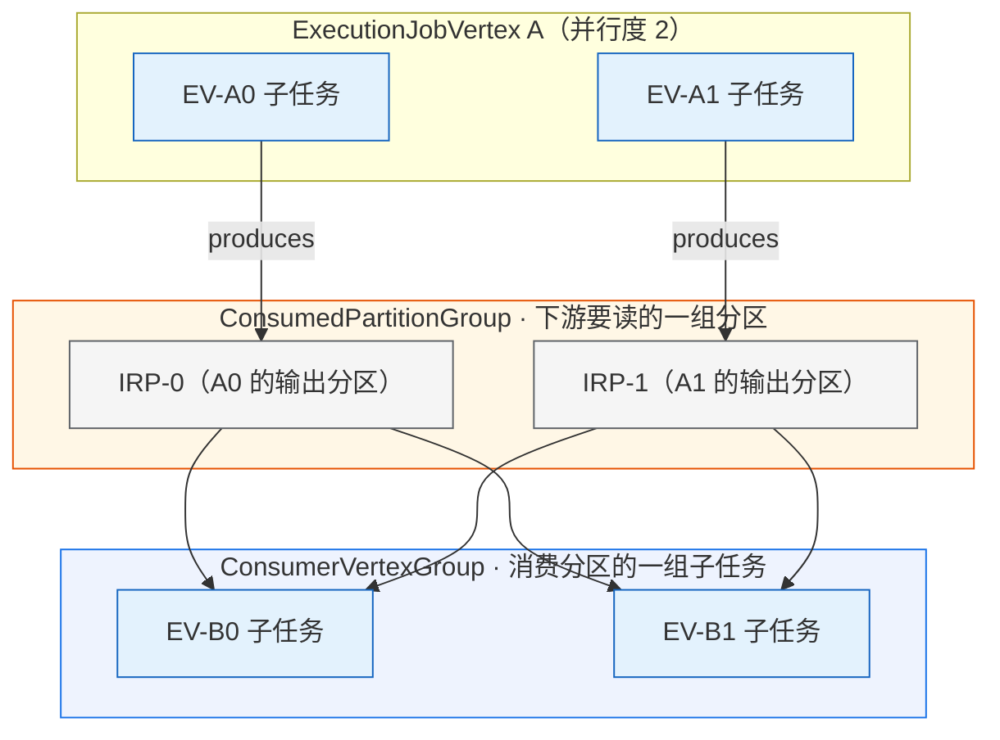

读这张图的要点：

- **顶点是 `ExecutionVertex`（子任务）**，每个上游子任务 `produces` 出一个 `IntermediateResultPartition`（IRP-0 属于 A0、IRP-1 属于 A1）——分区数 = 生产者并行度。
- **数据分区是图的"一等公民"**：下游不直接连上游子任务，而是连到中间的 IRP。这正是 ExecutionGraph 区别于 JobGraph 的地方。
- **`ConsumedPartitionGroup`** 框住"下游要一起读的那组分区"（这里是 {IRP-0, IRP-1}）；**`ConsumerVertexGroup`** 框住"消费这组分区的那组子任务"（{EV-B0, EV-B1}）。二者由 `EdgeManager` 互相引用，就是图里那 4 条 ALL_TO_ALL 连线的紧凑表达——不需要为每条线建一个对象。
- 若换成 **POINTWISE**（Forward/Rescale），则不是全连接，而是按区间"点对点"：例如 IRP-0→B0、IRP-1→B1。

## 七、完整示例：WordCount 的展开

承接前一篇的 JobGraph：`JobVertex A [Source→flatMap]` --ALL_TO_ALL(Hash)--> `JobVertex B [sum→Sink]`。设两个 JobVertex 并行度均为 2，展开后的 ExecutionGraph 如下：

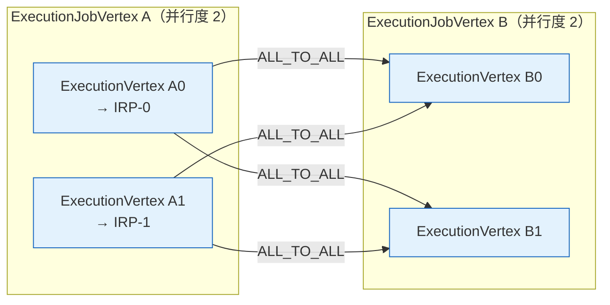

- EJV-A 展开为 `EV-A0 / EV-A1`，EJV-B 展开为 `EV-B0 / EV-B1`；
- A 产出的 `IntermediateResult` 裂成 2 个分区：`IRP-0`（由 EV-A0 产出）、`IRP-1`（由 EV-A1 产出）；
- ALL_TO_ALL 连边：`ConsumedPartitionGroup = {IRP-0, IRP-1}`，`ConsumerVertexGroup = {EV-B0, EV-B1}`——每个 B 子任务消费全部 A 分区；
- 每个 EV 各持有一个 `Execution`（attempt 0）。

## 八、两个补充点

### 8.1 动态图（AdaptiveBatch）延迟展开

注意 `attachJobGraph` 里那句 `if (!isDynamic)`：动态图会**跳过** `initializeJobVertices`。因为批作业的自适应并行度需要根据上游产出的数据量在运行时才决定，此时并不知道该建几个 ExecutionVertex。等并行度确定后，再对相应顶点调用 `initializeJobVertex` 完成展开。这正是自适应批调度（Adaptive Batch Scheduler）的基础。

### 8.2 Execution：一次执行尝试

`Execution` 代表 ExecutionVertex 的"一次执行尝试"。当某个子任务失败触发 failover 时，`ExecutionVertex.resetForNewExecution()` 会创建一个新的 `Execution`（attemptNumber+1），承接新的部署与状态恢复；而 `ExecutionVertex` 作为"子任务槽位"保持不变。这把"逻辑子任务"与"具体执行尝试"清晰地分开了。

## 九、DefaultExecutionTopology：从执行图到调度拓扑

ExecutionGraph 构建完毕后，`attachJobGraph` 的最后两行做了一件对后续调度至关重要的事：

```java
executionTopology = DefaultExecutionTopology.fromExecutionGraph(this);
partitionGroupReleaseStrategy = partitionGroupReleaseStrategyFactory.createInstance(getSchedulingTopology());
```

`DefaultExecutionTopology` 是 `SchedulingTopology` 接口的默认实现——它不是一张新图，而是 ExecutionGraph 面向调度器的**轻量级适配视图**。调度器（`SchedulerBase`）不直接操作 ExecutionGraph 的内部结构，而是通过这个拓扑视图来查询顶点状态、遍历分区、划分调度单元。

### 9.1 三大职责

| 职责 | 说明 |
|------|------|
| **适配转换** | 将 `ExecutionVertex` → `DefaultExecutionVertex`，`IntermediateResultPartition` → `DefaultResultPartition`，提供调度器所需的精简接口 |
| **Region 划分** | 将整张图划分为若干 `DefaultSchedulingPipelinedRegion`——这是调度的最小单元，也是 failover 的最小重启单元 |
| **查询服务** | `getVertex(id)`、`getResultPartition(id)`、`getPipelinedRegionOfVertex(id)`、`getAllPipelinedRegions()` |

### 9.2 构建流程

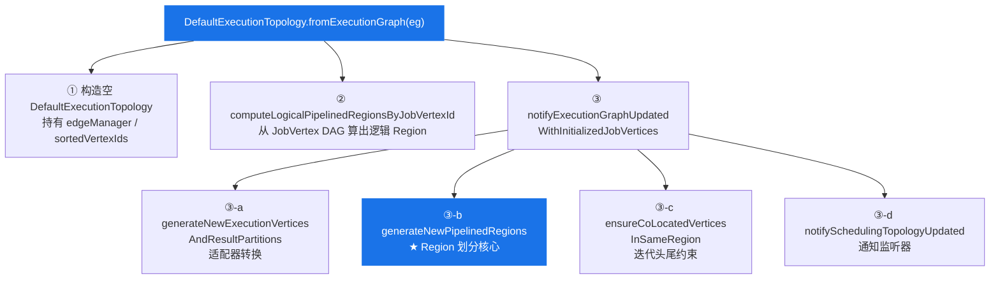

### 9.3 适配器层：为什么要包一层

`DefaultExecutionVertex` 和 `DefaultResultPartition` 是对 ExecutionGraph 内部对象的轻量包装。它们的关键设计是**用 `Supplier` 延迟获取状态**：

```java
// DefaultExecutionVertex 构造（精简）
DefaultExecutionVertex(
    ExecutionVertexID id,
    List<DefaultResultPartition> producedPartitions,
    Supplier<ExecutionState> stateSupplier,         // 调度时实时拿最新状态
    List<ConsumedPartitionGroup> consumedPartitionGroups,
    Function<IntermediateResultPartitionID, DefaultResultPartition> resultPartitionRetriever
)
```

这样做的好处：

- **解耦**：调度器只依赖 `SchedulingExecutionVertex` 接口，不需要了解 ExecutionGraph 内部的 Execution、状态机等复杂逻辑。
- **实时性**：状态通过 Supplier 获取，调度决策总是基于最新的 ExecutionState，无需同步更新。
- **不可变视图**：调度器拿到的对象没有修改入口，只能读取——防止调度逻辑意外篡改执行图。

## 十、Pipelined Region 划分：调度的最小单元

Region 划分是 `DefaultExecutionTopology` 最核心的能力。一个 **Pipelined Region** 是一组通过 pipelined 边连接的子任务集合——它们必须**同时调度、同时重启**。

> **为什么需要 Region？** Pipelined 边意味着上下游同时运行、数据实时流动（反压机制）。如果只调度下游而上游没运行，下游拿不到数据；如果只重启上游而下游还活着，上游无法重新发送已消费的数据。因此，pipelined 连接的子任务必须作为一个整体来调度和恢复。

### 10.1 两层 Region 设计

Region 的计算分为**两层**——先在 JobVertex（逻辑）粒度粗算，再在 ExecutionVertex（物理）粒度细分：

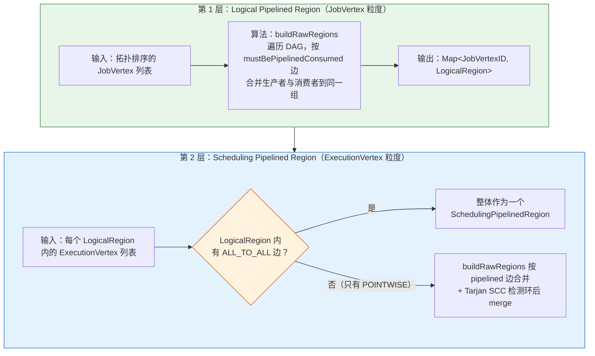

### 10.2 第 1 层：Logical Pipelined Region

在构建 `DefaultExecutionTopology` 时，首先调用 `computeLogicalPipelinedRegionsByJobVertexId`：

```java
// DefaultExecutionTopology 构造时
DefaultLogicalTopology.fromTopologicallySortedJobVertices(jobVertices)
    .getAllPipelinedRegions();  // → Set<DefaultLogicalPipelinedRegion>
```

内部使用 `PipelinedRegionComputeUtil.buildRawRegions`——这是一个**基于 Union-Find 思想的线性算法**：

```java
// PipelinedRegionComputeUtil.buildRawRegions（核心逻辑）
for (V vertex : topologicallySortedVertices) {
    Set<V> currentRegion = new HashSet<>();
    currentRegion.add(vertex);
    vertexToRegion.put(vertex, currentRegion);

    for (R consumedResult : getMustBePipelinedConsumedResults(vertex)) {
        V producerVertex = consumedResult.getProducer();
        Set<V> producerRegion = vertexToRegion.get(producerVertex);
        if (currentRegion != producerRegion) {
            // 合并：把小集合并入大集合（减少开销）
            currentRegion = mergeVertexGroups(currentRegion, producerRegion, vertexToRegion);
        }
    }
}
```

逻辑很直接：**如果当前顶点通过 pipelined 边连接到某个生产者，就把它们合并到同一个 Region**。遍历结束后，通过 blocking 边连接的顶点自然分属不同 Region。

> **注意**：LogicalPipelinedRegion 是 JobVertex 粒度的——它把通过 pipelined 边相连的 *JobVertex* 归为一组。在 JobGraph 这个 DAG 层面没有环（DAG 定义），所以不需要做 SCC 检测。

### 10.3 第 2 层：Scheduling Pipelined Region

第 2 层在每个 LogicalPipelinedRegion **内部**，对其展开后的 ExecutionVertex 做更精细的划分。关键分支逻辑在 `generateNewPipelinedRegions` 里：

```java
for (Map.Entry<DefaultLogicalPipelinedRegion, List<DefaultExecutionVertex>> entry : ...) {
    DefaultLogicalPipelinedRegion logicalRegion = entry.getKey();
    List<DefaultExecutionVertex> vertices = entry.getValue();

    if (containsIntraRegionAllToAllEdge(logicalRegion)) {
        // 情况 A：有 ALL_TO_ALL 边 → 整体一个 Region
        rawPipelinedRegions.add(new HashSet<>(vertices));
    } else {
        // 情况 B：只有 POINTWISE 边 → 可能拆分为多个 Region
        rawPipelinedRegions.addAll(
            SchedulingPipelinedRegionComputeUtil.computePipelinedRegions(vertices, ...));
    }
}
```

#### 情况 A：有 ALL_TO_ALL 边 → 不拆分

无论这条 ALL_TO_ALL 边是 pipelined 还是 blocking，都把 LogicalRegion 内所有子任务归入同一个 SchedulingPipelinedRegion。原因：

- **Pipelined ALL_TO_ALL**：全连接 + pipelined = 所有子任务必须同时运行，天然一个 Region。
- **Blocking ALL_TO_ALL（Region 内）**：如果拆开，可能出现**调度死锁**——Region 之间形成循环依赖（FLINK-17330）。为安全起见，合并为一个 Region。

#### 情况 B：只有 POINTWISE 边 → 可细分 + SCC 合并

POINTWISE 连接时，上下游并行度可能不同，子任务间不是全连接。此时用 `buildRawRegions` 在 ExecutionVertex 粒度再做一次 pipelined 边合并，然后用 **Tarjan 强连通分量算法**检测 Region 之间是否有环——如果有，就合并成一个 Region：

```java
// SchedulingPipelinedRegionComputeUtil.computePipelinedRegions
Map<..., Set<...>> vertexToRegion = buildRawRegions(vertices, getMustBePipelinedConsumedResults);
return mergeRegionsOnCycles(vertexToRegion, executionVertexRetriever);

// mergeRegionsOnCycles：
// 1. 把每个初始 Region 当作一个节点
// 2. Region 之间的 blocking 边作为有向边
// 3. 用 Tarjan SCC 找强连通分量
// 4. 同一 SCC 内的 Region 合并为一个
```

> **为什么 blocking 边会形成环？** 考虑一个迭代场景：Region A 通过 blocking 边输出给 Region B，Region B 又通过 blocking 边输出给 Region A（迭代反馈）。如果它们是独立 Region，调度时 A 等 B 完成、B 等 A 完成——死锁。Tarjan SCC 检测出这种循环后，把 A 和 B 合并为一个 Region，问题就消失了。

### 10.4 最终检查：CoLocation 约束

Region 划分完成后，还有一个校验步骤 `ensureCoLocatedVerticesInSameRegion`：

```java
// 迭代头 (IterationHead) 和迭代尾 (IterationTail) 有 CoLocationConstraint
// 它们必须部署到同一 TaskManager 的同一 Slot，也必须在同一 Region
for (DefaultSchedulingPipelinedRegion region : pipelinedRegions) {
    for (DefaultExecutionVertex vertex : region.getVertices()) {
        CoLocationConstraint constraint = getCoLocationConstraint(vertex.getId(), ...);
        if (constraint != null) {
            checkState(constraintToRegion.get(constraint) == null || constraintToRegion.get(constraint) == region);
        }
    }
}
```

如果配对的迭代头尾不在同一 Region，会直接抛异常。正常情况下 pipelined 边的合并逻辑已经保证了这一点，这里只是做防御性校验。

## 十一、案例：混合边的 Region 划分

用一个稍复杂的案例来完整展示 Region 划分过程。假设有如下作业拓扑（并行度均为 2）：

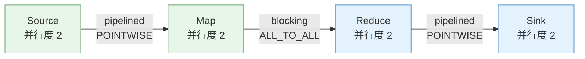

### 步骤 1：第 1 层 — Logical Pipelined Region 划分

在 JobVertex 粒度，按 `mustBePipelinedConsumed` 边合并：

- Source → Map：pipelined 边 → 合并为同一组
- Map → Reduce：blocking 边 → 不合并，切断
- Reduce → Sink：pipelined 边 → 合并为同一组

结果：**LogicalRegion-1 = {Source, Map}**，**LogicalRegion-2 = {Reduce, Sink}**

### 步骤 2：第 2 层 — Scheduling Pipelined Region 划分

#### LogicalRegion-1 {Source, Map}：

- 内部边：Source → Map 是 POINTWISE（Forward），没有 ALL_TO_ALL 边
- 走情况 B：用 `buildRawRegions` 在 ExecutionVertex 粒度合并
- Source[0] → Map[0] 通过 pipelined POINTWISE 连接 → 合并
- Source[1] → Map[1] 通过 pipelined POINTWISE 连接 → 合并
- Tarjan SCC：没有环，无需额外合并

结果：**Region-A = {Source[0], Map[0]}**，**Region-B = {Source[1], Map[1]}**

#### LogicalRegion-2 {Reduce, Sink}：

- 内部边：Reduce → Sink 是 POINTWISE（Forward），没有 ALL_TO_ALL 边
- 走情况 B：同理
- Reduce[0] → Sink[0] → 合并
- Reduce[1] → Sink[1] → 合并

结果：**Region-C = {Reduce[0], Sink[0]}**，**Region-D = {Reduce[1], Sink[1]}**

### 步骤 3：最终结果

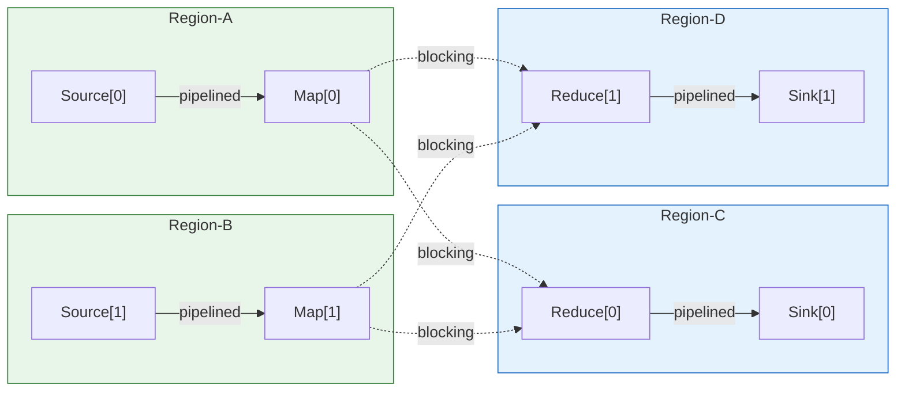

| Region | 包含的子任务 | 调度行为 |
|--------|-----------|---------|
| Region-A | Source[0], Map[0] | 可独立调度；内部 pipelined，同时启动 |
| Region-B | Source[1], Map[1] | 可独立调度；与 Region-A 并行 |
| Region-C | Reduce[0], Sink[0] | 等 Region-A/B 的 blocking 输出全部就绪后调度 |
| Region-D | Reduce[1], Sink[1] | 同 Region-C，等上游 blocking 数据就绪 |

> **对比：如果 Map → Reduce 是 pipelined ALL_TO_ALL**（流模式 keyBy），则整个 DAG 所有 8 个子任务会被合并为**一个 Region**——因为 pipelined 全连接把所有人"绑"在了一起。这也是流作业通常只有一个 Region 的原因。

### 10.5 DefaultSchedulingPipelinedRegion 的结构

每个 `DefaultSchedulingPipelinedRegion` 持有：

- `executionVertices`：Region 内所有子任务的 Map（按 ID 索引）
- `nonPipelinedConsumedPartitionGroups`：该 Region 消费的所有非 pipelined 上游分区组——调度时用来判断"上游数据是否就绪"
- `releaseBySchedulerConsumedPartitionGroups`：需要由调度器负责释放的分区组

调度器在决定是否启动一个 Region 时，会检查其 `nonPipelinedConsumedPartitionGroups` 中所有分区是否已处于 `ALL_DATA_PRODUCED` 状态——只有全部就绪，Region 才可调度。

## 十二、PartitionGroupReleaseStrategy 简介

`DefaultExecutionTopology` 建好后，`attachJobGraph` 最后一步创建分区释放策略：

```java
partitionGroupReleaseStrategy = partitionGroupReleaseStrategyFactory.createInstance(getSchedulingTopology());
```

默认实现 `RegionPartitionGroupReleaseStrategy` 基于 Region 拓扑做引用计数：当一个 blocking 分区组的所有消费 Region 都执行完毕后，该分区组的数据就可以被释放（回收磁盘/网络资源）。如果配置 `jobmanager.partition.release-during-job-execution = false`，则使用 `NotReleasingPartitionGroupReleaseStrategy`，等作业结束才统一释放。

## 十三、小结

从 JobGraph 到 ExecutionGraph 再到 DefaultExecutionTopology，本质是**按并行度展开逻辑图为物理执行图，再划分调度单元**。完整脉络：

1. **构建时机**：在 SchedulerNG（`SchedulerBase`）构造时完成，是创建 Scheduler 的副产物，而非 `startScheduling()` 的动作。
2. **buildGraph**：搭空图 → master 初始化 → 拓扑排序 → `attachJobGraph` → 配置 checkpoint。
3. **两趟处理**：先 JobVertex → 空壳 ExecutionJobVertex 登记，再 `initializeJobVertex` 填充；保证连边时上游已就位。
4. **并行展开**：ExecutionJobVertex 裂成 N 个 ExecutionVertex，IntermediateResult 裂成 N 个 IntermediateResultPartition，每个 ExecutionVertex 持一个 Execution。
5. **连边**：按 POINTWISE / ALL_TO_ALL，用 `ConsumedPartitionGroup` + `ConsumerVertexGroup` 分组表达，避免对象化边的 O(n²) 开销。
6. **调度拓扑**：`DefaultExecutionTopology` 适配转换 + 两层 Region 划分（Logical → Scheduling），为调度器提供"按 Region 调度"的基础结构。
7. **Region 语义**：同一 Region 内的子任务同时调度、同时重启；Region 之间通过 blocking 边解耦，可以串行执行、资源复用、故障隔离。

`DefaultExecutionTopology` 是后续调度流程的核心输入——`startScheduling()` 会遍历所有 Region，检查输入就绪状态，按 Region 粒度申请 Slot 并部署 Task。那是本系列的下一站。
