---
math: true
pin: true
mermaid: true

title:    Flink 源码 | Flink 调度全景：从 SlotPool 到 ResourceManager 的资源闭环
date:     2026-07-27
author:   Aiden
image: 
  path : source/internal/data-stream.jpg
categories : ['分布式']
tags : ['计算引擎']

--- 


> 基于 Apache Flink 2.2.0 源码分析 · SlotPoolService、SchedulerNG 与 ResourceManager 三大核心如何协作完成作业调度

> ⚠️ **版本与范围：**本文基于 Apache Flink 2.2.0，聚焦 YARN 部署模式。相关类分布于 flink-runtime 模块。承接《从 JobGraph 到 ExecutionGraph》，覆盖 `startScheduling()` 之后的完整调度闭环，收束在 `Execution.deploy()` 为止。

前一篇我们把 JobGraph 展开成了 ExecutionGraph 并划分好 Pipelined Region。但到这一步为止，所有东西都还只是"图纸"——没有真正的计算资源被占用。

本文回答的就是接下来那个关键问题：**"Region 被调度器选中后，Slot 到底是怎么来的、中间经过了谁、最终怎么把 Task 部署到 TaskManager 上？"**

答案涉及三大核心模块：

- **SlotPoolService**：JobMaster 内部的 Slot 池，负责"管 Slot、对外声明需求、收 Slot offer"
- **SchedulerNG**：调度的主控逻辑，负责"选 Region、要 Slot、最终 deploy"
- **ResourceManager**：集群的资源大管家，负责"算缺口、让 TM 分配、必要时向 YARN 申请新机器"

我们按 **SlotPoolService → SchedulerNG → ResourceManager** 的顺序，从近到远逐层展开。

## 一、全文总览

先用一张图把整个调度闭环"从头到尾"串起来。后续各章节就是对这张图里每一块的逐步拆解。


> **一句话记住闭环：**调度器选 Region → 向 SlotPool 要 Slot → SlotPool 向 RM 声明"我要多少资源" → RM 让 TM 分配 Slot → TM 把 Slot offer 回 SlotPool → SlotPool 匹配请求、回填 future → 调度器拿到 LogicalSlot 后部署 Task。

## 二、Part 1: SlotPoolService — JobMaster 的资源管理核心

SlotPoolService 是整个调度链的**中间枢纽**——调度器找它要 Slot，它找 ResourceManager 要资源。理解它，就理解了 Slot 从"被申请"到"被拿到"中间到底发生了什么。

### 2.1 一个对象，三张脸

SlotPoolService 的设计很有意思：它是**一个对象**（`DeclarativeSlotPoolBridge`），但对外暴露**三层接口**，不同的调用方看到的是不同的"脸"：

| 接口 | 面向谁 | 核心方法 |
|------|--------|----------|
| `SlotPoolService` | JobMaster 生命周期管理 | `start` / `close` / `connectToResourceManager` / `disconnectResourceManager` / `offerSlots` |
| `SlotPool` | 调度器（PhysicalSlotProvider） | `allocateAvailableSlot` / `requestNewAllocatedSlot` / `requestNewAllocatedBatchSlot` / `releaseSlot` |
| `DeclarativeSlotPool` | Bridge 内部 | `increaseResourceRequirementsBy` / `decreaseResourceRequirementsBy` / `offerSlots` / `reserveFreeSlot` |

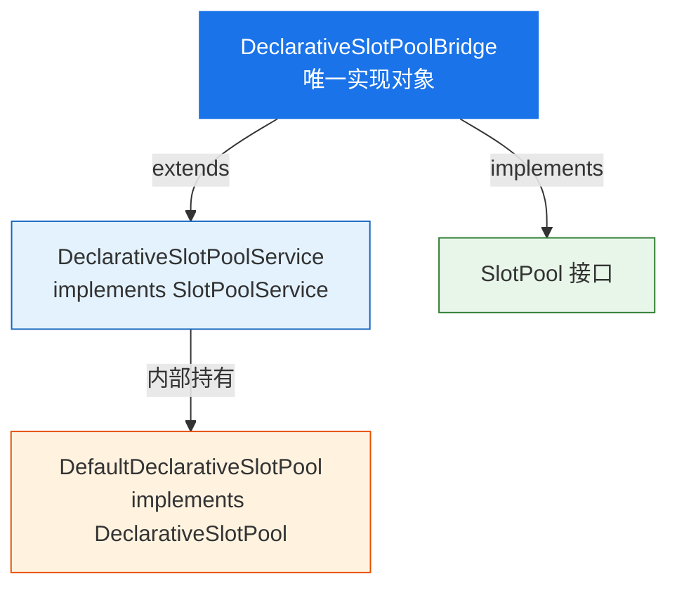

> **设计目的：**三层接口把"生命周期管理"、"调度分配"、"内部需求声明"干净地隔开。JobMaster 只看 `SlotPoolService`，调度器只看 `SlotPool`，声明式协议细节全藏在 `DeclarativeSlotPool` 里。

### 2.2 生命周期：什么时候干什么

SlotPool 的一生可以用一个简单的状态机来理解——创建后等启动，启动后可以连/断 RM，最后关闭：

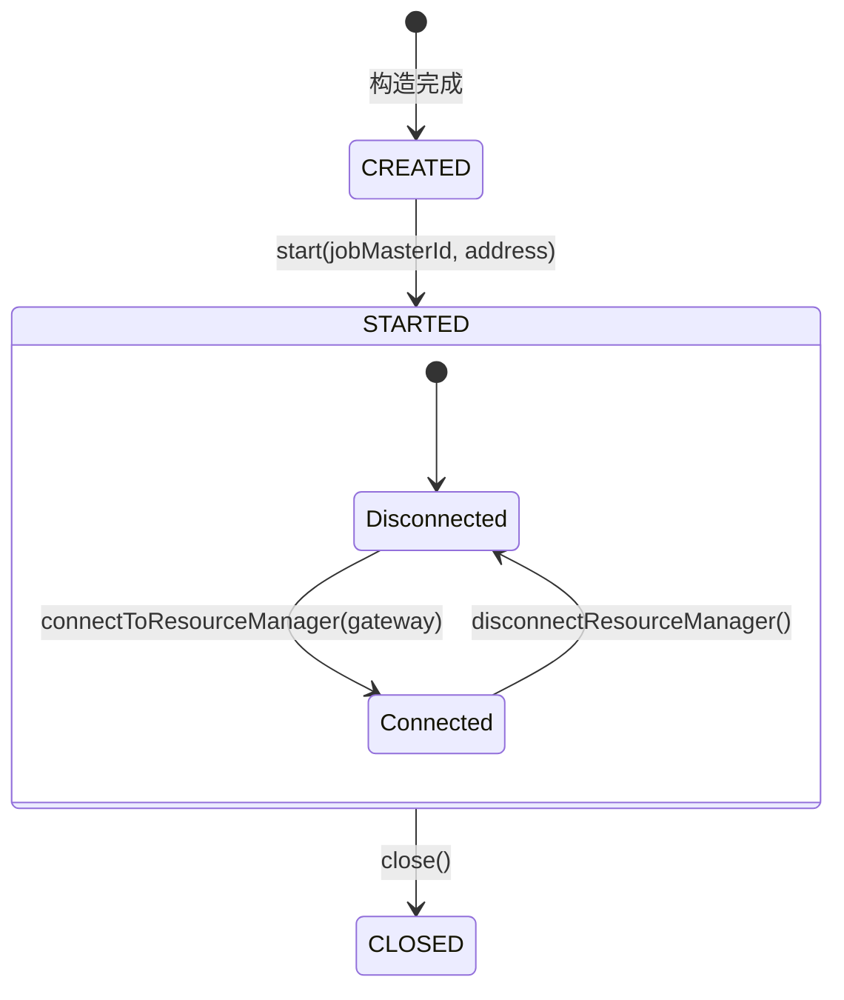

| 事件 | 动作 |
|------|------|
| `start(jobMasterId, address)` | 创建 `ConnectionManager`（带重试的声明发送）；注册 `NewSlotsListener`；启动 idleSlotTimeout 与 batchSlotTimeout 定时器 |
| `connectToResourceManager(gateway)` | ConnectionManager 连上（把 `rmGateway.declareRequiredResources` 设为回调）；**立即声明当前资源需求** |
| `disconnectResourceManager()` | 断开声明通道，停止发送声明；但**已持有的 slot 不释放** |
| `close()` | cancel 所有 pending 请求；释放所有 TM 上的 slot；关闭 ConnectionManager |

> ⚠️ **disconnect 不丢 slot：**RM 故障时 SlotPool 保留已有 slot 继续服务，重连后立即重声明。这确保了 RM 短暂故障不会导致正在运行的作业丢失资源。

### 2.3 声明式资源协议：不下单，只说"我总共要多少"

这是 Flink 2.x 与早期版本最本质的区别。打个比方：**老版本像点外卖——"来一份 A，再来一份 B"；新版本像报预算——"我这个月需要 10 份 A、5 份 B，你看着给我安排"。**

具体来说：**JobMaster 不对 RM 说"给我第 3 个 slot"，而是声明"我这个作业总共需要 N 个这种规格的 slot"。**

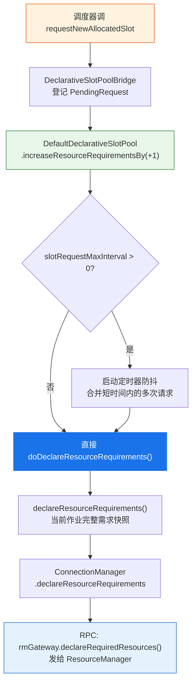

关键细节：

- **声明"总量快照"，协议幂等**：`getResourceRequirements()` 返回 `profile → count` 完整映射，RM 收到目标状态自行对齐差异。
- **防抖合并**（`slotRequestMaxInterval`）：连续的 increaseResourceRequirementsBy 被合并到一次定时器回调统一声明。
- **指数退避重试**（1ms → 10s）：发送失败后自动重试，新需求产生时旧重试自动取消。
- **connectToRM 时立即重声明**：确保 RM 切换后新 RM 立刻收到完整需求。

### 2.4 Slot 怎么进来的：offerSlots

Slot 不是 SlotPool 自己"生产"的——它是 TaskManager "送过来"的。当 RM 让 TM 分配好 Slot 后，TM 会主动调 `JobMaster.offerSlots()`，这是 Slot 进入 SlotPool 的**唯一入口**：

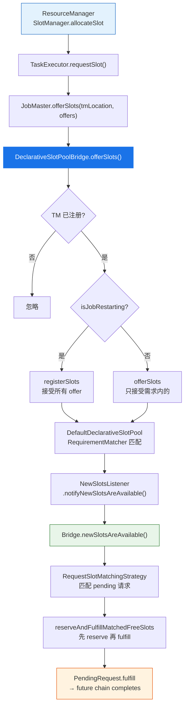

匹配要点：

- **直接分配模式**（默认）：新 slot 到来立刻匹配 pending 请求。
- **延迟分配模式**（`deferSlotAllocation=true`）：等资源聚齐后一次性匹配，适用于批作业。
- **reserve-then-fulfill 顺序**：先 reserve 所有匹配到的 slot，再逐个 fulfill——避免 fulfill 触发的新请求抢占刚匹配好的 slot。
- **future chain 回填**：`PendingRequest.fulfill(slot)` → PhysicalSlot future 完成 → SharedSlot 拿到物理 slot → LogicalSlot future 完成 → 唤醒部署阶段。

### 2.5 Slot 的一生

一个 Slot 从进入 SlotPool 到最终被回收，经历的状态很直观：

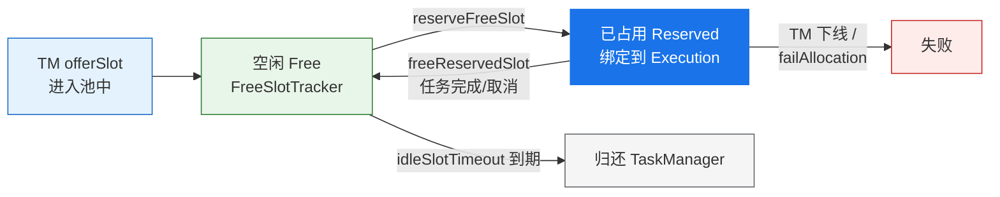

| 场景 | 触发 | SlotPool 动作 |
|------|------|---------------|
| **空闲超时回收** | `checkIdleSlotTimeout` 定时器 | `releaseIdleSlots(currentTime)` → 超过 idleSlotTimeout 且不被需求覆盖的 slot 归还 TM |
| **slot 释放** | 调度器不再需要 | `releaseSlot` → 移除 pending/fulfilled → `decreaseResourceRequirementsBy` → 声明更新 |
| **TM 下线** | 心跳超时 / 主动断开 | `releaseTaskManager` → 所有该 TM slot 失效 → Bridge 减需求 |
| **分配失败** | TM 拒绝 / 超时 | `failAllocation` → 释放该 slot → 返回 TM ID 给 JobMaster 清理 |
| **作业重启** | failover 触发 | `setIsJobRestarting(true)` → 后续 offerSlots 走 registerSlots 路径接受所有 offer |

> **需求与 slot 始终对账：**每次释放/失效都 `decreaseResourceRequirementsBy`，RM 始终看到真实需要。不会出现"需求声明了但 slot 没人用"的资源空耗。

## 三、Part 2: SchedulerNG — 调度决策与部署

SlotPool 讲清了"Slot 怎么管理"，这一部分回答"谁决定要调度什么、怎么把 Slot 请求发出去、拿到 Slot 后怎么部署"。这是调度的**主控逻辑**所在。

### 3.1 先认识一下参与调度的组件

`SlotPoolService` 与 `SchedulerNG` 在 `JobMaster` 构造阶段就已经建好，出自同一个工厂（保证配置一致）：

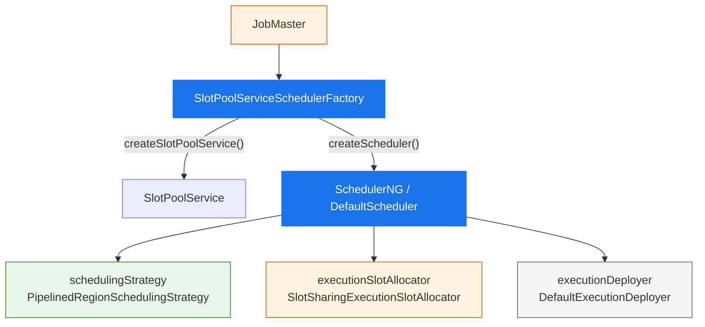

| 组件 | 实现类 | 职责 |
|------|--------|------|
| `slotPoolService` | `DeclarativeSlotPoolBridge` | 资源声明与回填 |
| `schedulingStrategy` | `PipelinedRegionSchedulingStrategy` | 调度决策：挑 Region、按拓扑序提交 |
| `executionSlotAllocator` | `SlotSharingExecutionSlotAllocator` | Slot 分配：按共享组聚合，切逻辑 Slot |
| `executionDeployer` | `DefaultExecutionDeployer` | 两阶段部署编排 |
| `physicalSlotProvider` | `PhysicalSlotProviderImpl` | 物理 Slot 获取：先复用后申请 |
| `bulkChecker` | `PhysicalSlotRequestBulkChecker` | Region 级整批可满足性检查 |

> ⚠️ **2.2.0 不存在 `DefaultExecutionSlotAllocator`**（部分老资料里有）。Slot 分配统一由 `SlotSharingExecutionSlotAllocator` 完成，部署逻辑被抽到独立的 `DefaultExecutionDeployer`。

### 3.2 启动与 startScheduling

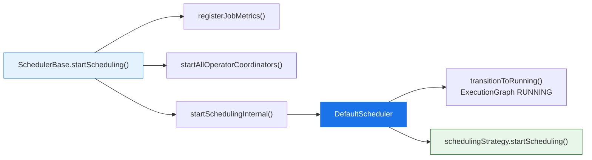

### 3.3 调度决策：先调度谁？

这是很多人最好奇的问题——**调度器怎么知道该先调度哪些任务？**答案是：按 Region 来，先调度"不依赖别人"的源 Region，然后 BFS 扩散到输入已就绪的下游 Region。

```java
// PipelinedRegionSchedulingStrategy.startScheduling
public void startScheduling() {
    Set<SchedulingPipelinedRegion> sourceRegions =
        IterableUtils.toStream(schedulingTopology.getAllPipelinedRegions())
            .filter(this::isSourceRegion)
            .collect(Collectors.toSet());
    maybeScheduleRegions(sourceRegions);
}
```

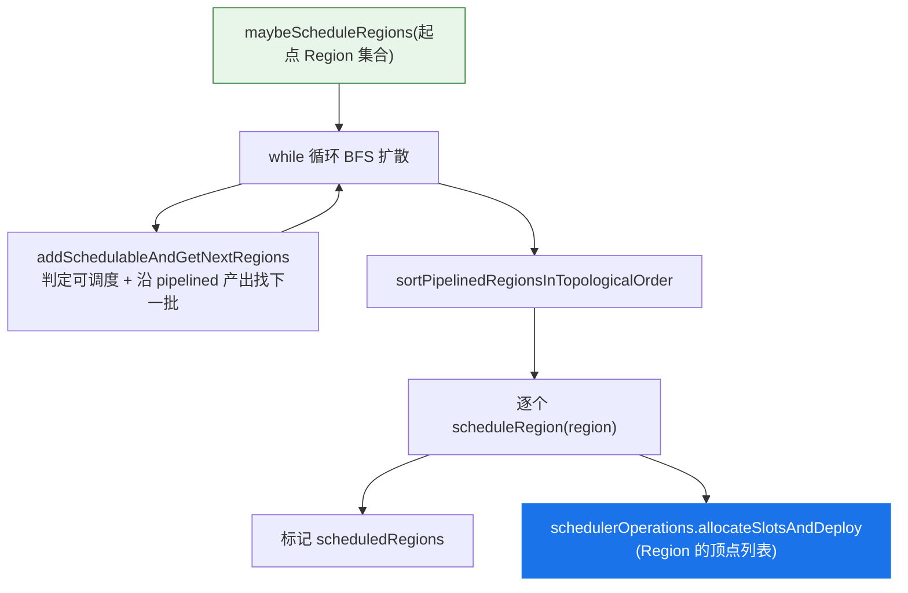

#### 可调度判定

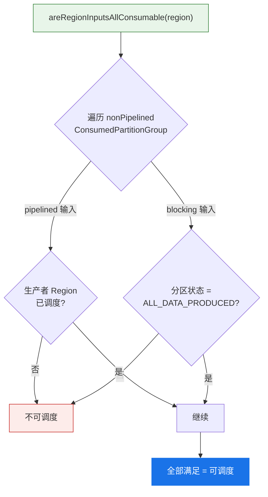

> **调度以 Region 为最小批次。**批作业上游 FINISHED 唤醒下游 blocking Region；流作业通常整图一个 Region 一次全调度。

### 3.4 allocateSlotsAndDeploy

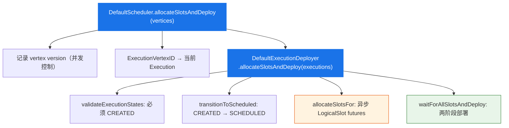

### 3.5 逻辑 Slot 分配：slot sharing 怎么落地

一个 Region 可能有几十个子任务，但不代表需要几十个物理 Slot——因为有 **slot sharing**。多个不同算子的第 i 个子任务可以共享同一个物理 Slot。这里就是它落地的地方。

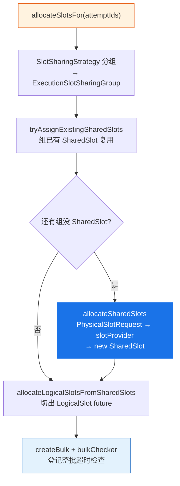

#### 对象关系

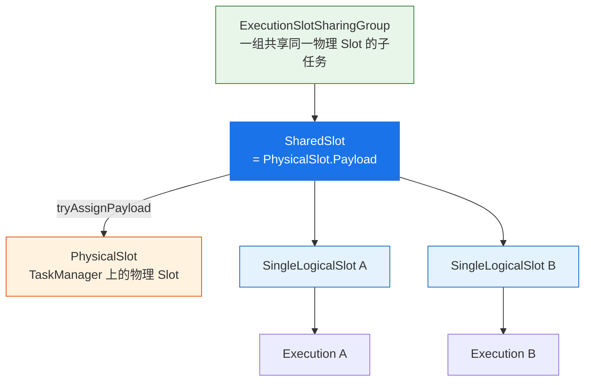

> ⚠️ **slot sharing 分组算法**（`LocalInputPreferredSlotSharingStrategy`）决定哪些子任务共享同一个物理 Slot，可单独成篇，本文点到为止。

### 3.6 物理 Slot：先看池子里有没有，没有才申请

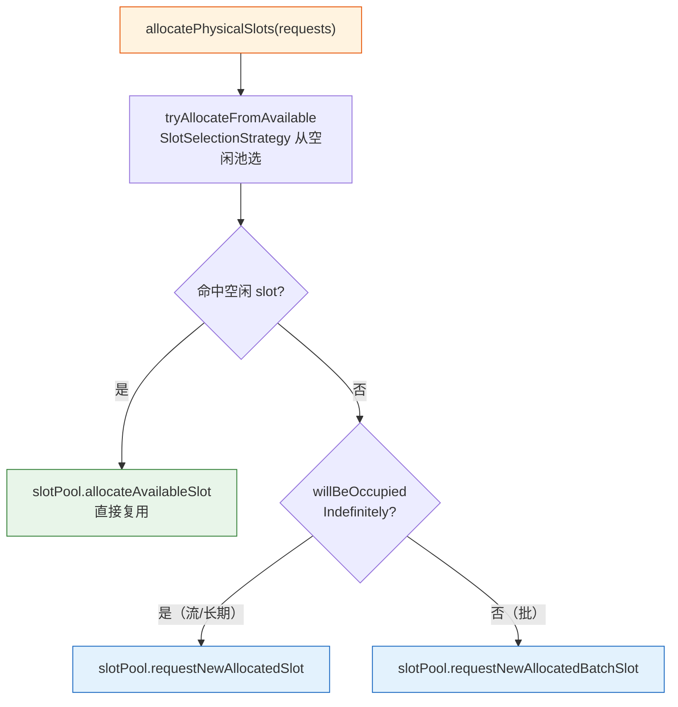

### 3.7 Bulk Checker：防止"半吊子"状态

想象一个 pipelined Region 有 8 个子任务必须同时跑。如果只拿到了 5 个 Slot，另外 3 个一直等不到，那这 5 个就白占着资源。Bulk Checker 就是防止这种情况的安全阀：

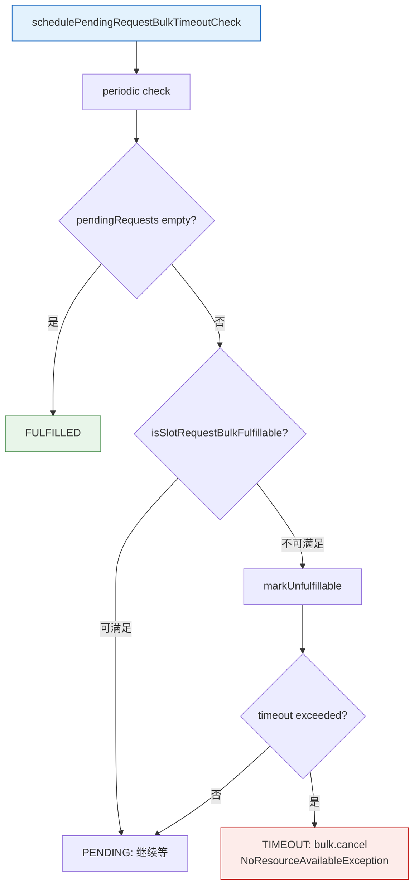

> **Region 级原子性：**要么全给要么整批超时取消。保证 Region 内任务不会出现"部分有 slot、部分没有"的半吊子状态。

### 3.8 两阶段部署：先集齐再统一出发

拿到所有 LogicalSlot 后，`DefaultExecutionDeployer` 并不是"谁先拿到谁先跑"，而是**先把所有任务的 Slot 都绑定好、分区都注册好，再统一发 deploy**。就像旅行团：等所有人都上了大巴再出发，不会丢下一个人。

```java
// waitForAllSlotsAndDeploy 核心逻辑
assignAllResourcesAndRegisterProducedPartitions(executionsToDeploy)
    .handle((ignored, throwable) -> {
        if (throwable == null) {
            deployAll(executionsToDeploy);  // Phase 2
        } else {
            handleDeploymentFailure(executionsToDeploy, throwable);
        }
        return null;
    });
```

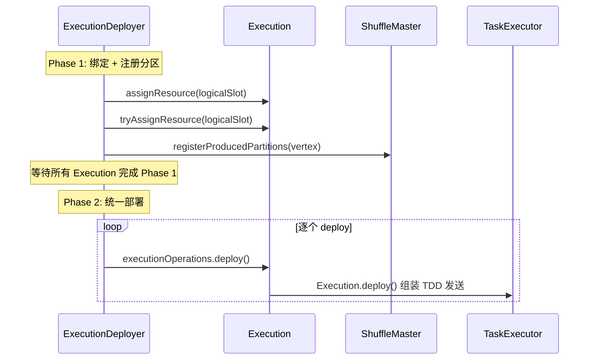

| 阶段 | 动作 |
|------|------|
| **Phase 1** | assignResource（绑定 LogicalSlot）+ registerProducedPartitions（向 ShuffleMaster 注册输出分区） |
| **Phase 2** | deployAll → 逐个 `Execution.deploy()` 组装 TaskDeploymentDescriptor (TDD) 发给 TaskManager |

> ⚠️ **为什么分两阶段：**下游部署时需要上游分区位置信息，先统一绑定 + 注册再统一 deploy，确保部署时所有依赖信息都已就绪。

## 四、Part 3: ResourceManager — 集群资源的供给侧

前两部分讲的都是 JobMaster 内部的事。这一部分跳出 JobMaster，看看 **ResourceManager 收到资源声明后，到底怎么把 Slot 变出来**。

### 4.1 RM 长什么样：核心组件一览

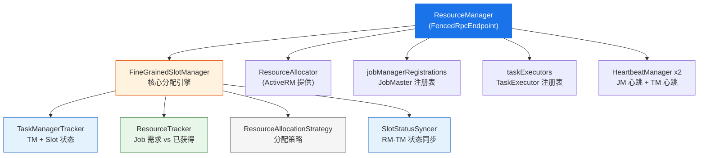

```java
// ResourceManager.onStart → startResourceManagerServices
jobLeaderIdService.start();
registerMetrics();
startHeartbeatServices();
slotManager.start(getFencingToken(), getMainThreadExecutor(), resourceAllocator, ...);
delegationTokenManager.start(this);
initialize(); // 子类（ActiveResourceManager）启动 ResourceManagerDriver
```

### 4.2 JobMaster 和 TM 怎么注册到 RM

在 RM 能分配 Slot 之前，它需要先知道"谁是谁"——JobMaster 和 TaskExecutor 都要先来注册。

#### JobMaster 注册（先握手，后续才能声明资源）

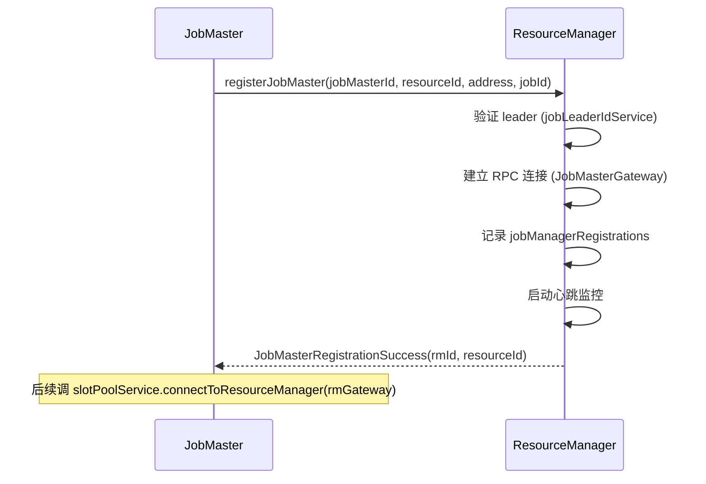

#### TaskExecutor 注册（TM 上线后告诉 RM "我有哪些 Slot"）

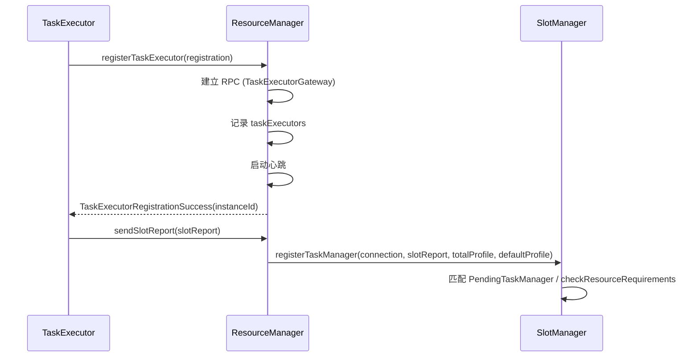

### 4.3 FineGrainedSlotManager：RM 的大脑

2.2.0 唯一的 SlotManager 实现。它的核心工作就一件事：**收到资源需求后，算出缺口，然后分配**。整个过程是延迟批处理的——不会每来一个需求就立刻反应，而是攒一攒一起处理（避免抖动）。

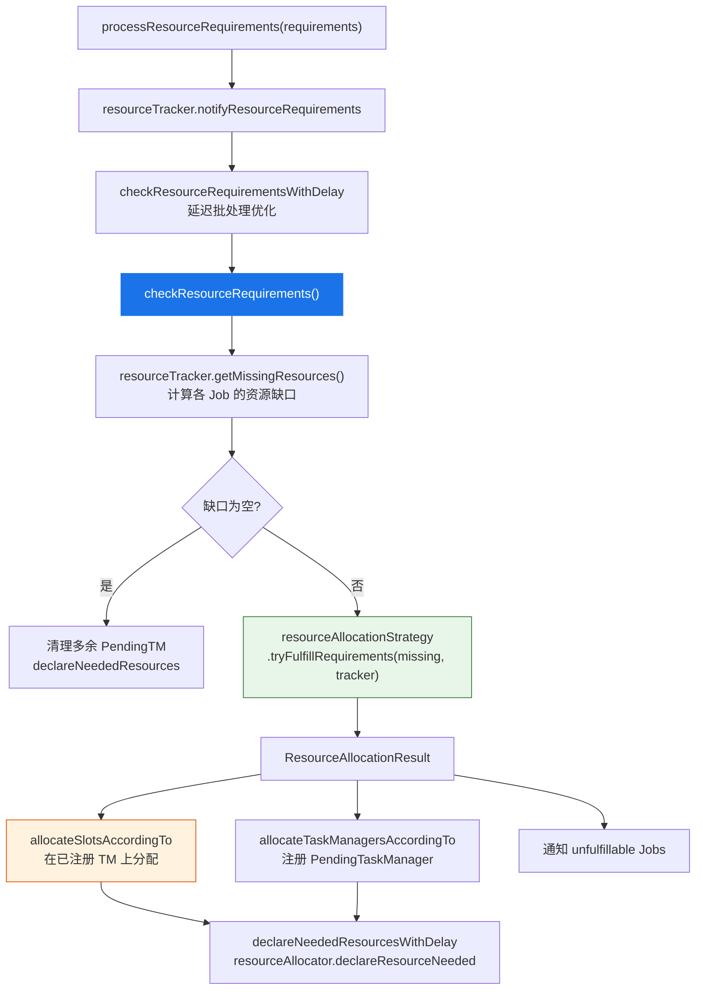

```java
// checkResourceRequirements 核心逻辑（简化）
Map<JobID, Collection<ResourceRequirement>> missingResources =
    resourceTracker.getMissingResources();
ResourceAllocationResult result =
    resourceAllocationStrategy.tryFulfillRequirements(
        missingResources, taskManagerTracker, ...);
allocateSlotsAccordingTo(result.getAllocationsOnRegisteredResources());
allocateTaskManagersAccordingTo(result.getPendingTaskManagersToAllocate());
taskManagerTracker.replaceAllPendingAllocations(
    result.getAllocationsOnPendingResources());
declareNeededResourcesWithDelay();
```

| ResourceAllocationResult 字段 | 含义 |
|-------------------------------|------|
| `allocationsOnRegisteredResources` | 在已注册的 TM 上直接分配的 slot 映射 |
| `allocationsOnPendingResources` | 在待启动的 TM (PendingTaskManager) 上预分配 |
| `pendingTaskManagersToAllocate` | 需要新申请的 PendingTaskManager 列表 |
| `unfulfillableJobs` | 无法满足资源需求的 Job 集合 |

### 4.4 SlotStatusSyncer：RM 怎么让 TM 真正分配 Slot

SlotManager 做完决策后，真正"动手"的是 `SlotStatusSyncer`——它负责给 TM 发 RPC 说"把这个 Slot 分给这个 Job"。设计上用了**乐观更新**：先假设会成功，RPC 回来再确认或回滚。

```mermaid
sequenceDiagram
    participant SM as SlotManager
    participant SSS as SlotStatusSyncer
    participant TMT as TaskManagerTracker
    participant RT as ResourceTracker
    participant TM as TaskExecutor
    participant JM as JobMaster

    SM->>SSS: allocateSlot(instanceId, jobId, targetAddress, profile)
    SSS->>TMT: notifySlotStatus(allocationId, PENDING)
    SSS->>RT: notifyAcquiredResource(jobId, profile)
    SSS->>TM: RPC gateway.requestSlot(slotId, jobId, allocationId, profile, jmAddress)
    TM->>TM: 预留 slot
    TM->>JM: offerSlots(tmLocation, offers)
    Note over JM: SlotPoolService.offerSlots -> 匹配 -> fulfill
    TM-->>SSS: Acknowledge
    SSS->>TMT: notifySlotStatus(allocationId, ALLOCATED)
```

> **乐观更新：**先假设成功（PENDING），RPC 完成后确认（ALLOCATED）或回滚（FREE）。这种设计避免了等待 RPC 响应期间阻塞后续分配。

### 4.5 YARN 场景：机器不够怎么办

如果现有的 TaskManager 不够用呢？这时候 `ActiveResourceManager` 就登场了——它会向 YARN 申请新的 Container 来启动新的 TaskManager。

YARN 模式下 ResourceManager 的子类是 `YarnResourceManager extends ActiveResourceManager`。ActiveResourceManager 通过 ResourceManagerDriver（`YarnResourceManagerDriver`）与 YARN RM 交互。

```mermaid
flowchart TB
    SM["SlotManager<br/>declareNeededResources()"] --> RA["ResourceAllocator<br/>.declareResourceNeeded(declarations)"]
    RA --> ARM["ActiveResourceManager<br/>.checkResourceDeclarations()"]
    ARM --> CMP{"每种规格:<br/>已有 vs 声明数量"}
    CMP -->|"不足"| REQ["requestNewWorker(spec)<br/>resourceManagerDriver.requestResource()"]
    CMP -->|"过多"| REL["releaseResource / releaseIdleWorker"]
    CMP -->|"相等"| NOP["无操作"]
    REQ --> YARN["YarnResourceManagerDriver<br/>向 YARN RM 申请 Container"]
    YARN --> STARTED["新 Container 启动 TaskManager"]
    STARTED --> REG["TM.registerTaskExecutor -> RM"]
    REG --> SLOT["sendSlotReport -> slotManager.registerTaskManager"]
    SLOT --> MATCH["匹配 PendingTaskManager<br/>allocateSlotsForRegisteredPendingTaskManager"]

    style SM fill:#1a73e8,color:#fff,stroke:none
    style ARM fill:#fff3e0,stroke:#e65100
    style YARN fill:#e8f5e9,stroke:#2e7d32
    style MATCH fill:#e3f2fd,stroke:#1565c0
```

关键要点：

- **declareResourceNeeded 是声明式的**：告诉 ActiveRM"每种规格当前总共需要多少个 worker"。
- **ActiveRM 做 diff**：（已有 + pending vs 声明）决定申请或释放 Container。
- **新 TM 启动注册后**：SlotManager 的 registerTaskManager 会匹配 PendingTaskManager，立刻 allocateSlot。
- **失败限流**：`startWorkerFailureRater` + `startWorkerCoolDown` 防止频繁失败导致主线程忙循环。

### 4.6 新 TM 来了之后：匹配 PendingTaskManager

YARN 申请的新 Container 启动了一个 TaskManager，它注册到 RM 后，SlotManager 会立刻看"之前有没有为它预留好的 Slot 分配计划"（即 PendingTaskManager 里记录的分配信息），如果有就直接在新 TM 上 allocateSlot：

```java
// registerTaskManager in FineGrainedSlotManager（简化）
// 新 TM 注册
taskManagerTracker.addTaskManager(connection, totalResource, defaultSlotResource);
// 尝试匹配已有的 PendingTaskManager
Optional<PendingTaskManager> matched =
    findMatchingPendingTaskManager(totalResource, defaultSlotResource);
if (matched.isPresent()) {
    allocateSlotsForRegisteredPendingTaskManager(
        matched.get(), instanceId);
    taskManagerTracker.removePendingTaskManager(
        matched.get().getPendingTaskManagerId());
} else {
    checkResourceRequirementsWithDelay(); // 新 TM 可能能满足其他 Job
}
```

## 五、全链路闭环：从选 Region 到 Task 跑起来

三大模块各自的细节讲完了，最后用一张时序图把它们串起来。从调度器选出 Region 开始，到 Task 真正被部署到 TaskManager 上——17 步一气呵成：

```mermaid
sequenceDiagram
    autonumber
    participant STG as SchedulingStrategy
    participant SCH as DefaultScheduler
    participant DEP as ExecutionDeployer
    participant ALLOC as SlotSharingExecutionSlotAllocator
    participant PROV as PhysicalSlotProvider
    participant POOL as SlotPool(DeclarativeSlotPoolBridge)
    participant RM as ResourceManager
    participant SM as FineGrainedSlotManager
    participant TM as TaskExecutor

    STG->>SCH: allocateSlotsAndDeploy(Region vertices)
    SCH->>DEP: allocateSlotsAndDeploy(executions)
    DEP->>ALLOC: allocateSlotsFor(attemptIds)
    ALLOC->>PROV: allocatePhysicalSlots(requests)
    PROV->>POOL: requestNewAllocatedSlot
    POOL->>POOL: 登记 PendingRequest + increaseRequirements
    POOL->>RM: declareRequiredResources(totalRequirements)
    RM->>SM: processResourceRequirements
    SM->>SM: checkResourceRequirements -> tryFulfillRequirements
    SM->>TM: SlotStatusSyncer.allocateSlot -> requestSlot RPC
    TM->>POOL: offerSlots(tmLocation, offers)
    POOL->>POOL: 匹配 + fulfill(PendingRequest)
    POOL-->>PROV: PhysicalSlot future 完成
    PROV-->>ALLOC: SharedSlot ready
    ALLOC-->>DEP: LogicalSlot future 完成
    DEP->>TM: Phase1: assignResource + registerPartitions
    DEP->>TM: Phase2: Execution.deploy() 发 TDD
```

## 六、小结：记住这几个关键点就够了

1. **SlotPoolService 是枢纽**——向上给调度器提供 Slot 分配接口，向下用声明式协议对接 RM。它不生产 Slot，只负责"登记需求 + 收 offer + 匹配"。
2. **调度以 Region 为单位**——不是逐个子任务调度，而是一整个 Region（可能包含多个子任务）作为一批提交。Region 内的 Slot 要么全给，要么全不给（Bulk Checker 保证）。
3. **声明式协议让系统松耦合**——JobMaster 只说"我总共要多少"，RM 自己去对齐。协议幂等、天然支持重连恢复。
4. **FineGrainedSlotManager 是 RM 的大脑**——收需求、算缺口、决策分配、管 TM。延迟批处理避免抖动。
5. **YARN 场景是"按需伸缩"**——现有 TM 不够就申请新 Container；多了就释放。ActiveResourceManager 做 diff 驱动。
6. **两阶段部署保证原子性**——先集齐所有 Slot 并注册分区，再统一 deploy。不会出现"部署了一半"的中间态。

至此，从 ExecutionGraph 的 Region 划分，到调度器选出 Region、申请 Slot、RM 侧响应需求分配 TM、Slot offer 回流、两阶段部署——整个调度闭环走完了。

如果你只想记一件事，记这个：**调度的本质是一个异步的"需求声明→资源匹配→部署"闭环，各组件通过 future 和声明式协议松耦合，这让整个系统具备了良好的可恢复性和可扩展性。**
